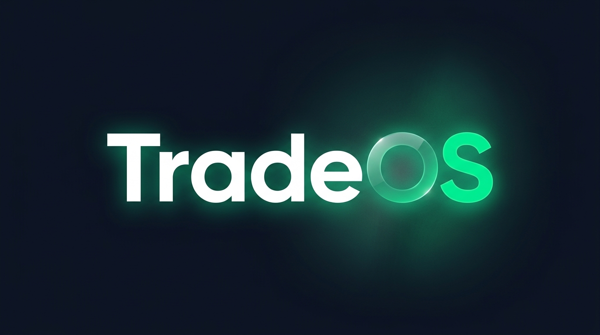
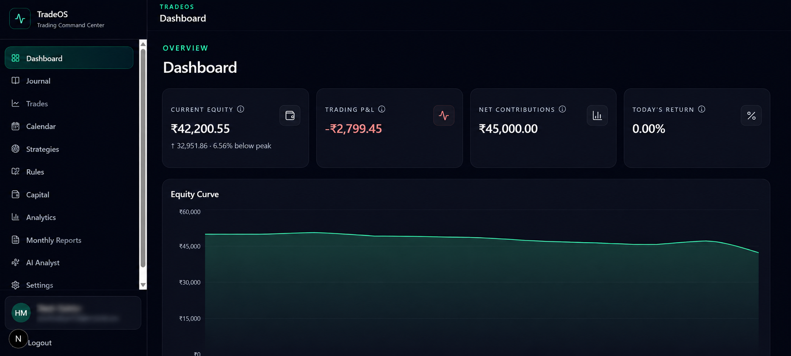
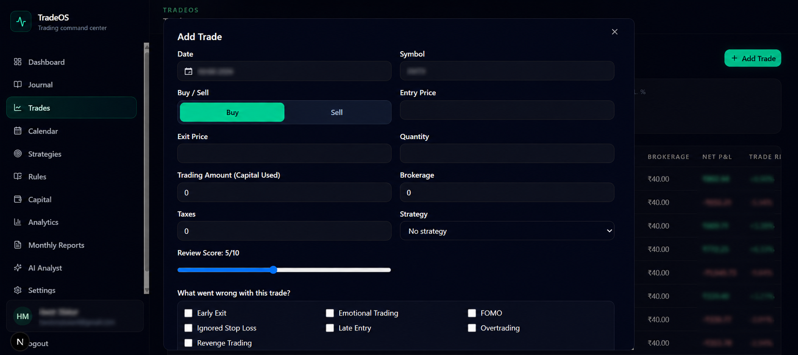
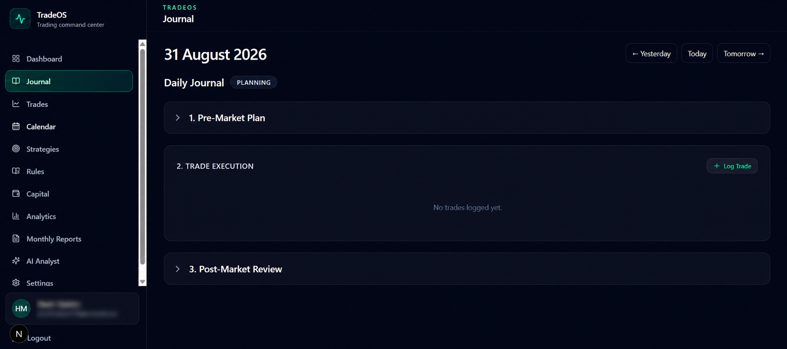
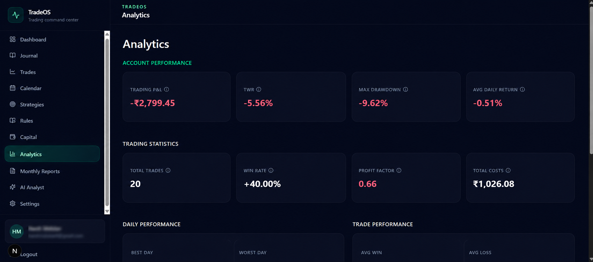
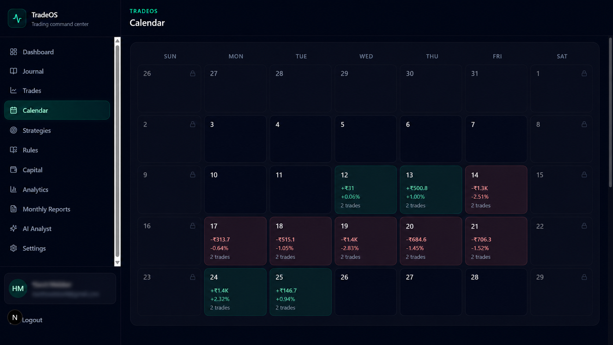
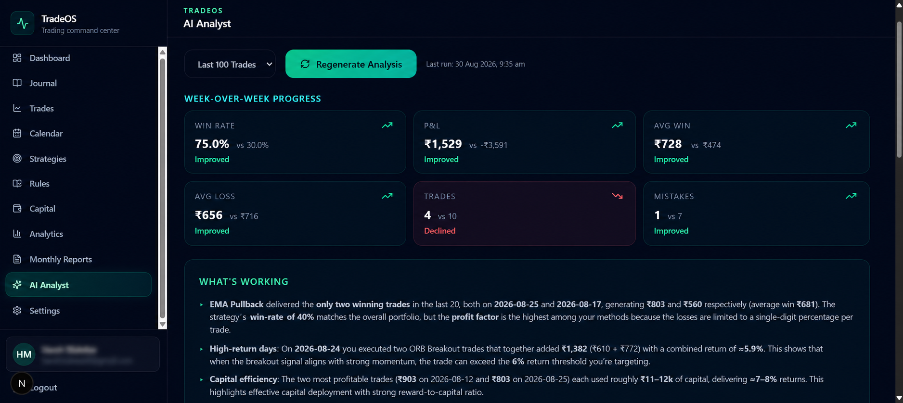

<div align="center">
  

  ### Personal Trading Operating System for Indian F&O Traders

  [Demo](#) | [Live App](#) | [GitHub](https://github.com/HARSH2413/Tradeos)
</div>

TradeOS is a full-stack trading journal and performance analysis platform designed to help traders record, review and understand their trading behavior.

## Why I built this

Trading is as much a psychological discipline as it is a financial one. I built TradeOS because existing journals were either too complex, lacked integrated rule-tracking, or didn't provide actionable feedback. 

TradeOS acts as a personal accountability partner—forcing you to stick to your rules, review your mistakes, and use AI to objectively analyze your progress week over week without emotional bias.

## Features

- **Dashboard** — KPI cards, equity curve, monthly P&L chart, and today's progress tracker
- **Trade Journal** — Log trades with auto-calculated P&L, capital used %, return %, brokerage and taxes
- **Calendar View** — Visual heatmap of daily performance with drill-down into individual trades
- **Strategies** — Define and track strategies with win rate and net P&L per strategy
- **Rules** — Set entry, exit, risk management, and psychology rules; track adherence per trade
- **Daily Journal** — Pre-market planning and post-market review workflow with AI summary
- **Analytics** — Win rate, profit factor, average win/loss, strategy breakdown, and cost analysis
- **Monthly Reports** — Isolated monthly performance with compounding balance tracking
- **AI Trade Analyst** — AI-powered analysis of your trading data using GPT-OSS-120B via Groq
- **Settings** — Starting capital, default brokerage/tax, and account reset

## Tech Stack

- **Framework**: [Next.js 15](https://nextjs.org/) (App Router, Server Components, Server Actions)
- **Language**: TypeScript
- **Styling**: [Tailwind CSS v4](https://tailwindcss.com/)
- **Database & Auth**: [Supabase](https://supabase.com/) (PostgreSQL, Row Level Security, Auth)
- **Charts**: [Recharts](https://recharts.org/)
- **AI**: [Groq](https://groq.com/) (GPT-OSS-120B)
- **Icons**: [Lucide React](https://lucide.dev/)

## Getting Started

### Prerequisites

- Node.js 18+
- A [Supabase](https://supabase.com/) project (free tier works)
- (Optional) A [Groq](https://console.groq.com/) API key for the AI Analyst feature

### 1. Clone and install

```bash
git clone https://github.com/HARSH2413/Tradeos.git
cd tradeos
npm install
```

### 2. Set up environment variables

Copy the example environment file and fill in your values:

```bash
cp .env.example .env.local
```

Edit `.env.local` with your Supabase project URL, anon key, and (optionally) your Groq API key.

### 3. Set up the database

Run the entire contents of [`supabase-schema.sql`](./supabase-schema.sql) in your Supabase project's **SQL Editor**. This creates all tables, indexes, RLS policies, triggers, and RPC functions.

### 4. Run the dev server

```bash
npm run dev
```

Open [http://localhost:3000](http://localhost:3000) to start using TradeOS.

## Project Structure

```
src/
├── app/
│   ├── (dashboard)/       # Authenticated routes (layout with sidebar)
│   │   ├── dashboard/     # Main dashboard with KPIs and charts
│   │   ├── trades/        # Trade journal with add/edit/delete
│   │   ├── calendar/      # Calendar heatmap view
│   │   ├── strategies/    # Strategy management
│   │   ├── rules/         # Trading rules
│   │   ├── journal/       # Daily pre/post-market journal
│   │   ├── analytics/     # Performance analytics
│   │   ├── reports/       # Monthly reports
│   │   ├── analysis/      # AI trade analyst
│   │   └── settings/      # User settings
│   ├── auth/callback/     # Supabase auth callback
│   └── login/             # Login / Sign up page
├── components/            # React components
│   ├── ui/                # Base UI primitives
│   ├── dashboard/         # Dashboard-specific components
│   ├── trades/            # Trade form and table
│   ├── journal/           # Journal form components
│   ├── analysis/          # AI analyst component
│   ├── settings/          # Settings form and reset
│   └── rules/             # Rule checklist cards
├── lib/
│   ├── supabase/          # Supabase client, server, config, session, types
│   ├── calculations.ts    # Trade P&L calculations
│   ├── formatters.ts      # Currency and percentage formatters (INR)
│   ├── dashboard-data.ts  # Shared types and Supabase type wrapper
│   └── indian-symbols.ts  # NSE F&O symbol autocomplete list
└── middleware.ts          # Auth middleware for route protection
```

## Deployment

Deploy to [Vercel](https://vercel.com/) for the best Next.js experience:

1. Push your repo to GitHub
2. Import the project in Vercel
3. Add your environment variables in the Vercel dashboard
4. Deploy

## Screenshots

### Dashboard


### Trade Journal


### Daily Journal


### Analytics


### Calendar


### AI Analyst


## Roadmap

- [ ] Mobile App / PWA Support
- [ ] Integration with Indian Brokers (Zerodha, Upstox) API for auto-sync
- [ ] Advanced AI charting analysis
- [ ] Options Greek tracking

## License

This project is licensed under the [MIT License](./LICENSE).
