## 1. Project Overview

### Purpose
TradeOS is a **personal trading journal and performance tracker** built specifically for **Indian F&O (Futures & Options) traders**. It allows traders to record trades, plan daily sessions, review mistakes, track capital, enforce trading rules, and receive AI-powered analysis — all from a single dark-themed workspace.

### Target Users
Individual Indian F&O traders who trade instruments on the NSE (NIFTY, BANKNIFTY, individual stock F&O). The app is denominated in INR (₹) and ships with 120+ pre-loaded NSE symbols.

### Main Features
| Feature | Description |
|---|---|
| Dashboard | KPI cards, equity curve, monthly P&L chart, weekday accuracy, today's progress tracker, capital ledger |
| Trade Journal | Log trades with auto-calculated P&L, brokerage/taxes, capital used %, return %, mistakes, rule adherence |
| Daily Journal | Per-symbol pre-market planning + post-market review workflow with structured forms |
| Calendar | Monthly heatmap of daily P&L, color-coded days, drill-down into individual trades |
| Strategies | Define strategies with conditions, entry/exit/SL/target rules, track win rate & P&L per strategy |
| Rules | Create entry/exit/risk/psychology rules, check adherence per trade |
| Analytics | Win rate, profit factor, avg win/loss, strategy breakdown, cost analysis |
| Monthly Reports | Isolated monthly performance with compounding balance tracking |
| AI Trade Analyst | openai/gpt-oss-120b via Groq API — data-driven analysis of trading performance |
| Settings | Profile, default brokerage/tax, capital management, account reset with CSV export |

### Tech Stack

| Layer | Technology |
|---|---|
| Framework | Next.js 15 (App Router, Server Components, Server Actions) |
| Language | TypeScript |
| Styling | Tailwind CSS v4 |
| Database & Auth | Supabase (PostgreSQL, Row Level Security, Auth) |
| Charts | Recharts |
| AI | Groq (openai/gpt-oss-120b) via Next.js Server Action |
| Icons | Lucide React |
| Date Utilities | date-fns |
| UI Primitives | shadcn/ui (Base UI) — 21 components |

### Architecture

```
┌───────────────────────────────────────────────────────────────┐
│                        Browser (Client)                       │
│  React 19 · Tailwind · Recharts · Lucide · date-fns          │
│  Client Components: TradeForm, AiAnalyst, SettingsForm, etc.  │
├───────────────────────────────────────────────────────────────┤
│                    Next.js 15 App Router                      │
│  Server Components (pages) · Server Actions · Middleware      │
│  @supabase/ssr cookie management                              │
├───────────────────────────────────────────────────────────────┤
│                     Supabase (BaaS)                           │
│  Auth (email/password) · PostgreSQL · RLS · RPC functions     │
├───────────────────────────────────────────────────────────────┤
│                     Groq API (External)                       │
│  openai/gpt-oss-120b — fetched securely via Server Actions          │
└───────────────────────────────────────────────────────────────┘
```

> [!NOTE]
> There is **no custom backend server**. All "backend" logic is implemented via Next.js Server Actions and Supabase RPC functions. The AI feature calls Groq directly from the client browser.

---


## 2. Complete Workflow

### Application Startup

1. User visits `/` → [page.tsx](file:///c:/Games/New%20folder/src/app/page.tsx) checks `isSupabaseConfigured()` → if not configured, redirects to `/login`
2. If configured, calls `getSupabaseSession()` → if user exists, redirect to `/dashboard`; otherwise `/login`
3. **Middleware** ([middleware.ts](file:///c:/Games/New%20folder/src/middleware.ts)) runs on every protected route:
   - Defines `protectedRoutes`: `/dashboard`, `/trades`, `/calendar`, `/strategies`, `/rules`, `/analytics`, `/reports`, `/settings`, `/journal`, `/analysis`
   - Creates a Supabase server client with cookie-based auth
   - Calls `supabase.auth.getUser()` to validate the JWT token against Supabase Auth
   - If no user + protected route → redirect to `/login?redirectedFrom=<path>`
   - If user + on `/login` → redirect to `/dashboard`
   - Syncs auth cookies between request and response

### Authentication Flow

#### Sign Up
```
User fills form (fullName, email, password)
  → Client-side validation (email regex, password: 8+ chars, uppercase, lowercase, digit)
  → supabase.auth.signUp({ email, password, options: { data: { full_name }, emailRedirectTo } })
  → Supabase creates auth.users row
  → DB trigger `on_auth_user_created` fires `handle_new_user()`
    → INSERT into public.users (id, email, full_name)
    → INSERT into public.settings (user_id, starting_capital=10000, default_brokerage=0, default_tax=0)
  → If session returned immediately: redirect to /dashboard
  → If email confirmation required: show "Check your email" message
```

#### Sign In
```
User fills form (email, password)
  → Client-side email format validation
  → supabase.auth.signInWithPassword({ email, password })
  → On success: window.location.href = redirectedFrom (default: /dashboard)
  → On error: display error message
```

#### Email Confirmation Callback
```
User clicks email link → /auth/callback?code=<code>&next=<path>
  → route.ts GET handler
  → supabase.auth.exchangeCodeForSession(code)
  → Redirect to `next` param (default: /dashboard)
```

#### Sign Out
```
SignOutButton component → supabase.auth.signOut()
  → window.location.href = "/login" (forces full reload to clear router cache)
```

### Dashboard Layout Loading

When any `/dashboard/*` route loads ([layout.tsx](file:///c:/Games/New%20folder/src/app/(dashboard)/layout.tsx)):

```
getSupabaseSession() → validate user
  → If no user: redirect("/login")
  → Fetch profile: supabase.from("users").select("full_name,email").eq("id", user.id)
  → Render:
    ├── <NavigationProgress /> (top loading bar)
    ├── <Sidebar user={sidebarUser} /> (desktop, 288px width)
    └── <div>
        ├── <Header user={sidebarUser} /> (mobile sidebar trigger + title)
        └── <main>{children}</main>
```

---


## 3. Features

### 3.1 Dashboard
**File**: [dashboard/page.tsx](file:///c:/Games/New%20folder/src/app/(dashboard)/dashboard/page.tsx)

**What it does**: Shows a complete overview of the trader's account — current capital, today's P&L, KPI cards (ROI, win rate, profit factor, avg win/loss), weekday accuracy heatmap, equity curve chart, and monthly P&L bar chart.

**Data sources** (all fetched in parallel via `Promise.all`):
- `supabase.rpc("get_dashboard_stats", { p_user_id })` — aggregated stats from DB
- `supabase.rpc("get_equity_curve", { p_user_id })` — daily P&L sums
- `supabase.from("trades").select("date, net_pnl")` — raw trades for weekday analysis
- `supabase.from("capital_transactions").select("*").limit(10)` — recent funding transactions

**KPI Calculations** (performed server-side in the page component):
- `currentCapital = netFunding + totalNetPnl`
- `overallReturn = (totalNetPnl / netFunding) * 100`
- `todayReturn = todayNetPnl / yesterdayEndingBalance * 100`
- `yesterdayEndingBalance = netFunding + pnlBeforeToday`
- `profitFactor = |grossProfit / grossLoss|` (999 if no losses)
- `winRate = (winningTrades / totalTrades) * 100`
- `avgWin = grossProfit / winsCount`
- `avgLoss = |grossLoss| / lossesCount`

**Sub-components**:
- `<TodayTradingStatus />` — server component showing today's journal progress (planning → trading → reviewing → overall %)
- `<KpiCard />` — reusable card with title, value, icon, tone coloring, and optional tooltip
- `<CapitalLedgerPanel />` — sheet/drawer with deposit/withdrawal form and transaction history table
- `<EquityCurve />` — Recharts `AreaChart` (dynamic import)
- `<MonthlyPnlChart />` — Recharts `BarChart` (dynamic import)

---

### 3.2 Trade Journal
**Files**: [trades/page.tsx](file:///c:/Games/New%20folder/src/app/(dashboard)/trades/page.tsx), [trades/actions.ts](file:///c:/Games/New%20folder/src/app/(dashboard)/trades/actions.ts)

**What it does**: Main trade logging interface. Shows stats (total trades, net P&L, today's P&L %), a paginated table of all trades, and an "Add Trade" dialog.

**Pagination**: 25 items per page. Uses `searchParams.page` and Supabase `.range(from, to)`.

**Trade Form** ([trade-form.tsx](file:///c:/Games/New%20folder/src/components/trades/trade-form.tsx)):
- Fields: date, symbol (with NSE autocomplete datalist), buy/sell toggle, entry price, exit price, quantity, capital used (manual override), brokerage (default from settings), taxes (default from settings), strategy (dropdown), review score (1-10 slider), mistakes (checkboxes), rule adherence (radio: followed/broken/N/A), notes
- **Live preview**: as user types prices/quantity, `calculateTradeFields()` runs via `useMemo` and shows Gross P&L, Net P&L, Capital Used %, Trade Return %, and Result badge (WIN/LOSS/BREAKEVEN)
- Same form used for both Create and Edit (determined by `initialData` prop)

**Journal Gate**: When saving a trade, the server action checks for an existing `trading_days` row matching (user_id, date, symbol). If none exists, it returns `{ needsJournal: true }` and the client shows a `window.confirm()` asking to create one. If confirmed, it calls `upsertTradingDay()` first, then retries the trade save.

---

### 3.3 Daily Journal
**Files**: [journal/page.tsx](file:///c:/Games/New%20folder/src/app/(dashboard)/journal/page.tsx), [journal/actions.ts](file:///c:/Games/New%20folder/src/app/(dashboard)/journal/actions.ts)

**What it does**: A per-day, per-symbol structured trading journal with three phases:
1. **Pre-Market Plan** — market bias (bullish/bearish/neutral), expected market (trend/range/volatile), important price levels (custom JSON editor), market factors (checkboxes: Price Action, OI, PCR, etc.), watchlist, trading plan (goal/setup/avoid), rules reminder
2. **Trade Execution** — embedded `<TradeForm>` pre-filled with date and symbol, timeline view showing trade count and net P&L
3. **Post-Market Review** — market behaviour check, plan adherence check, biggest mistake (from global mistakes list), biggest achievement/learning (free text), day rating (1-10 slider), reflection, tomorrow's focus

**Status Machine** ([computeStatus.ts](file:///c:/Games/New%20folder/src/lib/journal/computeStatus.ts)):
```
if (post_market_completed) → "completed"
if (pre_market_completed && hasTrades) → "reviewing"
if (pre_market_completed) → "trading"
else → "planning"
```

**Navigation**: Date-based with "Yesterday", "Today", "Tomorrow" links. Symbol tabs for multiple instruments on the same day.

**Data model**: Uses `trading_days` table with `UNIQUE(user_id, date, symbol)` constraint. All saves use `upsertTradingDay()` with `onConflict: "user_id,date,symbol"`.

---

### 3.4 Calendar
**File**: [calendar/page.tsx](file:///c:/Games/New%20folder/src/app/(dashboard)/calendar/page.tsx)

**What it does**: Monthly calendar heatmap. Each day cell is color-coded:
- Green border/bg = positive net P&L
- Red border/bg = negative net P&L
- Amber border/bg = breakeven
- Star icon = post-market completed
- Book icon = pre-market completed but post not yet

**Drill-down**: Clicking a day shows trade details (symbol, type, qty, entry/exit, capital, return, net P&L, result badge) + journal summary (symbol, bias, execution, day rating). Links to journal page.

**Summary section**: Shows monthly Net P&L, Gross P&L, brokerage, and regulatory charges.

---

### 3.5 Strategies
**Files**: [strategies/page.tsx](file:///c:/Games/New%20folder/src/app/(dashboard)/strategies/page.tsx), [strategies/actions.ts](file:///c:/Games/New%20folder/src/app/(dashboard)/strategies/actions.ts)

**What it does**: CRUD for trading strategies. Each strategy card shows computed stats:
- Total trades using that strategy (filtered from all user trades by `strategy_id`)
- Win rate: `calculateWinRate(strategyTrades)`
- Net P&L: `sum(strategyTrades.net_pnl)`

**Fields**: name (required), market, conditions, entry rules, stop loss rules, target rules, notes.

---

### 3.6 Rules
**Files**: [rules/page.tsx](file:///c:/Games/New%20folder/src/app/(dashboard)/rules/page.tsx), [rules/actions.ts](file:///c:/Games/New%20folder/src/app/(dashboard)/rules/actions.ts)

**What it does**: CRUD for trading rules organized by category: `entry`, `exit`, `risk_management`, `psychology`.

**Rule Checklist Card** ([rule-checklist-card.tsx](file:///c:/Games/New%20folder/src/components/rules/rule-checklist-card.tsx)): Interactive card with client-side checkbox toggle (visual only — the checked state is not persisted to DB; it's a daily self-check tool). Delete via form action.

---

### 3.7 Analytics
**File**: [analytics/page.tsx](file:///c:/Games/New%20folder/src/app/(dashboard)/analytics/page.tsx)

**What it does**: Deep analytics across all trades:
- Top-level: Total Trades, Win Rate, Average Return %, Profit Factor, Total Costs
- Performance Metrics: Winning/Losing trade counts, Average Win, Average Loss, Total Brokerage, Total Taxes
- Strategy Analytics: Groups trades by `strategies.name`, shows count and net P&L per strategy

**All calculations done server-side** by fetching all trades and computing in the React server component.

---

### 3.8 Monthly Reports
**File**: [reports/page.tsx](file:///c:/Games/New%20folder/src/app/(dashboard)/reports/page.tsx)

**What it does**: Isolated monthly performance view with **compounding balance tracking**.

**Key calculation**: Starting balance for month M = original capital + sum of all net P&L before month M.

```
prevCumulativePnl = sum(net_pnl) WHERE date <= lastDayOfPreviousMonth
monthStartingBalance = originalCapital + prevCumulativePnl
monthNetPnl = sum(net_pnl) WHERE date IN currentMonth
monthEndingBalance = monthStartingBalance + monthNetPnl
monthReturn = (monthNetPnl / monthStartingBalance) * 100
```

**Highlights**: Best trade, worst trade, most used strategy, most common mistake (resolved by joining `trade_mistakes` → `mistakes.name`).

---

### 3.9 AI Trade Analyst
**Files**: [analysis/page.tsx](file:///c:/Games/New%20folder/src/app/(dashboard)/analysis/page.tsx), [ai-analyst.tsx](file:///c:/Games/New%20folder/src/components/analysis/ai-analyst.tsx)

**What it does**: Sends trade data and week-over-week comparisons to Groq (`openai/gpt-oss-120b`) for a highly structured, data-driven analysis of trader performance.

**How it works**:
1. Page (server component) fetches trades, strategies, rules, mistakes, settings, and last saved analysis.
2. `<AiAnalyst>` (client component) receives all data as props.
3. `computeWeeklyStats()` partitions trades into "this week" vs "last week" to render visual Progress Cards and injects comparison data into the prompt.
4. `buildPrompts()` function computes summary stats (win rate, P&L, best/worst trade, strategy breakdown, etc.) and formats them into a structured text prompt.
5. Sends `POST` to `https://api.groq.com/openai/v1/chat/completions` with:
   - `model: "openai/gpt-oss-120b"`
   - `temperature: 0.4` (Low temperature for strictly data-driven, non-hallucinated feedback)
   - `max_tokens: 4096`
   - System prompt defining the analyst persona (explicitly forbidding Markdown tables in favor of bullet points for UI compatibility).
   - User prompt with all trading data, plus Market Context (Nifty/BankNifty 5-day ranges).
6. Response is parsed into 7 sections: "What's working", "Where I'm losing money", "My biggest weakness", "Strategy performance", "Specific suggestions", "This week's focus", and "Progress since last week".
7. Result is saved to `ai_analysis` table in Supabase.
8. Each section is rendered with unique color theming and custom markdown parsing (bullet points, bold text).

**Gating & Rate Limits**:
- Requires `GROQ_API_KEY` in env.
- Requires minimum 5 trades to unlock.
- **Weekly Lock**: Once generated for the current week (resets Sunday at midnight), the "Regenerate Analysis" button is disabled to enforce a disciplined weekly review routine.

---

### 3.10 Settings
**Files**: [settings/page.tsx](file:///c:/Games/New%20folder/src/app/(dashboard)/settings/page.tsx), [settings/actions.ts](file:///c:/Games/New%20folder/src/app/(dashboard)/settings/actions.ts)

**What it does**:
- **Profile**: Edit full name (email is read-only)
- **Defaults**: Default brokerage and default tax per trade
- **Capital Management**: Link to dashboard capital ledger
- **Account Reset**: Two-step destructive action — must download CSV backup first, then type "RESET" to confirm

**Reset action** deletes: trades, strategies, rules, capital_transactions; resets brokerage/tax to 0 in settings. Profile and auth remain intact.

**Export** generates a CSV file with columns: Date, Symbol, Type, Strategy, Entry Price, Exit Price, Quantity, Capital Used, Gross P&L, Brokerage, Taxes, Net P&L, Return %, Notes.

---


## 4. Frontend

### 4.1 Page Map

| Route | File | Type | Key Components |
|---|---|---|---|
| `/` | `src/app/page.tsx` | Server | Redirect logic only |
| `/login` | `src/app/login/page.tsx` | Client | `LoginContent` |
| `/auth/callback` | `src/app/auth/callback/route.ts` | Route Handler | OAuth code exchange |
| `/dashboard` | `src/app/(dashboard)/dashboard/page.tsx` | Server | `DashboardContent`, `TodayTradingStatus`, `EquityCurve`, `MonthlyPnlChart`, `CapitalLedgerPanel`, `KpiCard` |
| `/trades` | `src/app/(dashboard)/trades/page.tsx` | Server | `TradesContent`, `TradeForm`, `TradeTable` |
| `/calendar` | `src/app/(dashboard)/calendar/page.tsx` | Server | `MonthSelector`, calendar grid, trade detail cards |
| `/strategies` | `src/app/(dashboard)/strategies/page.tsx` | Server | Strategy cards, create form |
| `/rules` | `src/app/(dashboard)/rules/page.tsx` | Server | `RuleChecklistCard`, create form |
| `/journal` | `src/app/(dashboard)/journal/page.tsx` | Server | `SymbolJournalPanel`, `PreMarketForm`, `PostMarketForm`, `DayTimeline`, `DayOverview`, `TradeForm` |
| `/analytics` | `src/app/(dashboard)/analytics/page.tsx` | Server | `Metric`, `groupByStrategy` |
| `/reports` | `src/app/(dashboard)/reports/page.tsx` | Server | `ReportContent`, `StatCard`, `TradeHighlight` |
| `/analysis` | `src/app/(dashboard)/analysis/page.tsx` | Server | `AiAnalyst` |
| `/settings` | `src/app/(dashboard)/settings/page.tsx` | Server | `SettingsForm`, `ResetAccountCard` |

### 4.2 Component Architecture

#### Layout Components
- **`Sidebar`** ([sidebar.tsx](file:///c:/Games/New%20folder/src/components/sidebar.tsx)): 10-item navigation, user avatar with initials, sign-out button. Desktop: sticky 288px sidebar. Mobile: Sheet (slide-out drawer) via `MobileSidebar`.
- **`Header`** ([header.tsx](file:///c:/Games/New%20folder/src/components/header.tsx)): Sticky top bar with mobile sidebar trigger. Shows current page title from a pathname-to-title map.
- **`NavigationProgress`** ([navigation-progress.tsx](file:///c:/Games/New%20folder/src/components/navigation-progress.tsx)): Top loading bar indicator during Next.js page transitions.

#### Client Components (interactive state)

| Component | File | State Managed |
|---|---|---|
| `TradeForm` | `trades/trade-form.tsx` | `open`, `tradeType`, `entryPrice`, `exitPrice`, `quantity`, `brokerage`, `taxes`, `reviewScore`, `manualCapitalUsed` |
| `AiAnalyst` | `analysis/ai-analyst.tsx` | `analysis`, `tradeCount`, `analysisDate`, `loading`, `error` |
| `SettingsForm` | `settings/settings-form.tsx` | `useActionState` for form state |
| `ResetAccountCard` | `settings/reset-account-card.tsx` | `confirmText`, `loading`, `downloaded` |
| `CapitalLedgerPanel` | `dashboard/capital-ledger-panel.tsx` | `isDialogOpen`, `error` |
| `SymbolJournalPanel` | `journal/symbol-journal-panel.tsx` | Collapsible section open states |
| `PreMarketForm` | `journal/pre-market-form.tsx` | `isOpen`, `isPending`, `watchlistStr` |
| `PostMarketForm` | `journal/post-market-form.tsx` | `isOpen`, `isPending`, `rating` |
| `RuleChecklistCard` | `rules/rule-checklist-card.tsx` | `checked` (client-only toggle) |
| `SignOutButton` | `sign-out-button.tsx` | `isLoading` |
| `LoginContent` | `login/page.tsx` | `mode`, `email`, `password`, `fullName`, `message`, `error`, `isSubmitting` |
| `Sidebar` (nav loading) | `sidebar.tsx` | `loadingHref` |

### 4.3 UI Primitives (shadcn/ui)

Located in `src/components/ui/`: `avatar`, `badge`, `button`, `calendar`, `card`, `checkbox`, `command`, `dialog`, `dropdown-menu`, `input`, `label`, `popover`, `scroll-area`, `select`, `separator`, `sheet`, `slider`, `table`, `tabs`, `textarea`, `tooltip` — 21 total.

### 4.4 Styling

- Global dark theme: `<html className="dark">` in root layout
- Base background: `bg-slate-950` with `radial-gradient` overlays
- Accent color: `emerald-400` (green) for profit/active states
- Loss color: `red-400` / `rose-400`
- Neutral color: `amber-400` for breakeven/warnings
- All formatting uses INR locale via `Intl.NumberFormat("en-IN", { style: "currency", currency: "INR" })`

### 4.5 Loading States

Every page in `(dashboard)/` has either:
- A top-level `loading.tsx` (spinner with "Loading Workspace..." text)
- `<Suspense>` boundaries with custom skeleton components (pulse-animated placeholder cards/charts)

---


## 5. Backend

### 5.1 Server Actions

There is **no Express/Fastify server**. All mutations are Next.js **Server Actions** (`"use server"`).

#### Trade Actions — [trades/actions.ts](file:///c:/Games/New%20folder/src/app/(dashboard)/trades/actions.ts)

| Function | Trigger | What it does |
|---|---|---|
| `createTrade(formData)` | TradeForm submit | Validates prices > 0, calls `get_capital_at_date` RPC, runs `calculateTradeFields()`, checks for existing `trading_days` row, calls `insert_trade_atomic` RPC, links trade to journal, revalidates `/dashboard`, `/trades`, `/calendar` |
| `updateTrade(formData)` | TradeForm edit submit | Same flow as create but calls `update_trade_atomic` RPC |
| `deleteTrade(formData)` | Delete button in TradeTable | `supabase.from("trades").delete().eq("id", id).eq("user_id", user.id)` |

#### Capital Actions — [dashboard/capital-actions.ts](file:///c:/Games/New%20folder/src/app/(dashboard)/dashboard/capital-actions.ts)

| Function | Trigger | What it does |
|---|---|---|
| `addCapitalTransaction(formData)` | Capital ledger dialog submit | Validates amount > 0, inserts with dummy `balance_after=0`, then calls `recomputeCapitalBalances()` |
| `deleteCapitalTransaction(id)` | Delete button in ledger | Deletes row, then calls `recomputeCapitalBalances()` |
| `recomputeCapitalBalances(userId, supabase)` | Called after add/delete | Fetches ALL transactions ordered by date ASC, iterates computing running balance (deposit = +, withdrawal = −), batch-updates any rows where `balance_after` differs |

#### Strategy Actions — [strategies/actions.ts](file:///c:/Games/New%20folder/src/app/(dashboard)/strategies/actions.ts)

| Function | Trigger | What it does |
|---|---|---|
| `createStrategy(formData)` | Strategy form submit | INSERT into `strategies` |
| `deleteStrategy(formData)` | Delete button | DELETE from `strategies` WHERE id AND user_id |

#### Rule Actions — [rules/actions.ts](file:///c:/Games/New%20folder/src/app/(dashboard)/rules/actions.ts)

| Function | Trigger | What it does |
|---|---|---|
| `createRule(formData)` | Rule form submit | INSERT into `rules` |
| `deleteRule(formData)` | Delete button | DELETE from `rules` WHERE id AND user_id |

#### Journal Actions — [journal/actions.ts](file:///c:/Games/New%20folder/src/app/(dashboard)/journal/actions.ts)

| Function | Trigger | What it does |
|---|---|---|
| `upsertTradingDay(input)` | Pre-market save, post-market save, new symbol creation, trade gate | UPSERT into `trading_days` with `onConflict: "user_id,date,symbol"`. Sets `pre_market_completed=true` or `post_market_completed=true` based on `formType`. |

#### Settings Actions — [settings/actions.ts](file:///c:/Games/New%20folder/src/app/(dashboard)/settings/actions.ts)

| Function | Trigger | What it does |
|---|---|---|
| `updateSettings(prevState, formData)` | Settings form submit | Updates `users.full_name`, upserts `settings.default_brokerage/default_tax` |
| `exportAccountData()` | Export button | Fetches all trades, strategies, rules, mistakes and returns as JSON |
| `resetAccountData()` | Reset confirm | Deletes all trades, strategies, rules, capital_transactions; resets settings defaults |

### 5.2 Session Management

**[session.ts](file:///c:/Games/New%20folder/src/lib/supabase/session.ts)**: `getSupabaseSession()` is a `React.cache()`-wrapped function that creates a Supabase server client and calls `getUser()`. Being cached, it deduplicates within a single request — called once per render tree regardless of how many components need it.

### 5.3 Supabase Client Creation

| Client | File | Usage |
|---|---|---|
| Server client | [server.ts](file:///c:/Games/New%20folder/src/lib/supabase/server.ts) | Server Components, Server Actions — uses `cookies()` from `next/headers` |
| Browser client | [client.ts](file:///c:/Games/New%20folder/src/lib/supabase/client.ts) | Client Components — `createBrowserClient()` |
| Middleware client | [middleware.ts](file:///c:/Games/New%20folder/src/middleware.ts) | Inline creation with cookie forwarding between request/response |

### 5.4 Config Check

[config.ts](file:///c:/Games/New%20folder/src/lib/supabase/config.ts): `isSupabaseConfigured()` validates:
- `NEXT_PUBLIC_SUPABASE_URL` exists and is a valid HTTP URL
- `NEXT_PUBLIC_SUPABASE_ANON_KEY` exists and is longer than 40 characters

---


## 11. Project Structure

```
src/
├── app/
│   ├── globals.css              # Tailwind v4 imports, CSS custom properties
│   ├── layout.tsx               # Root: <html dark>, metadata
│   ├── page.tsx                 # / — redirect to /login or /dashboard
│   ├── login/
│   │   └── page.tsx             # Client component: sign in / sign up form
│   ├── auth/
│   │   └── callback/
│   │       └── route.ts         # GET handler: exchange code for session
│   └── (dashboard)/             # Route group: shared sidebar layout
│       ├── layout.tsx           # Shared layout: sidebar + header + user fetch
│       ├── loading.tsx          # Global loading spinner
│       ├── dashboard/
│       │   ├── page.tsx         # Main dashboard: KPIs, charts, weekday stats
│       │   ├── capital-actions.ts  # Server actions: add/delete capital tx
│       │   └── loading.tsx      # Dashboard-specific skeleton
│       ├── trades/
│       │   ├── page.tsx         # Paginated trade list + stats
│       │   ├── actions.ts       # Server actions: create/update/delete trade
│       │   └── loading.tsx
│       ├── calendar/
│       │   ├── page.tsx         # Monthly heatmap + trade drill-down
│       │   └── loading.tsx
│       ├── strategies/
│       │   ├── page.tsx         # Strategy CRUD + stats per strategy
│       │   ├── actions.ts       # Server actions: create/delete strategy
│       │   └── loading.tsx
│       ├── rules/
│       │   ├── page.tsx         # Rule CRUD organized by category
│       │   ├── actions.ts       # Server actions: create/delete rule
│       │   └── loading.tsx
│       ├── journal/
│       │   ├── page.tsx         # Daily journal: symbol tabs, 3-phase workflow
│       │   ├── actions.ts       # Server action: upsertTradingDay
│       │   └── loading.tsx
│       ├── analytics/
│       │   ├── page.tsx         # All-time analytics + strategy breakdown
│       │   └── loading.tsx
│       ├── reports/
│       │   ├── page.tsx         # Monthly isolated reports + compounding
│       │   └── loading.tsx
│       ├── analysis/
│       │   ├── page.tsx         # AI analyst: data fetch + <AiAnalyst>
│       │   └── loading.tsx
│       └── settings/
│           ├── page.tsx         # Settings form + reset card
│           ├── actions.ts       # Server actions: update/export/reset
│           └── loading.tsx
├── components/
│   ├── sidebar.tsx              # Desktop sidebar + mobile sheet drawer
│   ├── header.tsx               # Sticky header with mobile trigger
│   ├── sign-out-button.tsx      # Supabase signOut + redirect
│   ├── submit-button.tsx        # Form submit with pending spinner
│   ├── navigation-progress.tsx  # Top loading bar
│   ├── phase-placeholder.tsx    # Generic placeholder card
│   ├── ui/                      # 21 shadcn/ui primitive components
│   ├── dashboard/
│   │   ├── kpi-card.tsx         # Metric card with icon + tone
│   │   ├── kpi-tooltip.tsx      # Info tooltip for KPI cards
│   │   ├── equity-curve.tsx     # Recharts AreaChart
│   │   ├── monthly-pnl-chart.tsx # Recharts BarChart
│   │   ├── capital-ledger-panel.tsx # Sheet with add/delete capital tx
│   │   ├── month-selector.tsx   # Dropdown month picker for calendar
│   │   └── today-trading-status.tsx # Today's journal progress tracker
│   ├── trades/
│   │   ├── trade-form.tsx       # Dialog form: add/edit trade (client)
│   │   └── trade-table.tsx      # Paginated trade table with edit/delete
│   ├── journal/
│   │   ├── symbol-journal-panel.tsx # Main journal panel: 3-phase layout
│   │   ├── pre-market-form.tsx  # Market outlook + levels + plan
│   │   ├── post-market-form.tsx # Review + rating + reflection
│   │   ├── day-overview.tsx     # Day summary metrics
│   │   ├── day-timeline.tsx     # Visual timeline of trading phases
│   │   └── level-editor.tsx     # JSONB price level editor
│   ├── analysis/
│   │   └── ai-analyst.tsx       # Client: Groq API call + result rendering
│   ├── settings/
│   │   ├── settings-form.tsx    # Profile + defaults form
│   │   └── reset-account-card.tsx # Danger zone: export + reset
│   ├── rules/
│   │   └── rule-checklist-card.tsx # Clickable checklist card
│   └── calendar/               # Empty directory (calendar inline in page)
├── lib/
│   ├── calculations.ts         # All P&L formulas
│   ├── formatters.ts           # INR currency + percentage formatters
│   ├── dashboard-data.ts       # App-level types + AppSupabase wrapper
│   ├── indian-symbols.ts       # 120+ NSE F&O symbols for autocomplete
│   ├── utils.ts                # cn() — clsx + tailwind-merge
│   ├── journal/
│   │   └── computeStatus.ts    # Journal status state machine
│   └── supabase/
│       ├── client.ts           # Browser Supabase client
│       ├── server.ts           # Server Supabase client (cookies)
│       ├── session.ts          # Cached session helper
│       ├── config.ts           # isSupabaseConfigured() check
│       └── types.ts            # Generated Supabase DB types
└── middleware.ts               # Route protection + cookie forwarding
```

---


## 12. Final System Map

```mermaid
graph TB
    subgraph Browser
        LOGIN["Login Page<br/>sign in / sign up"]
        SIDEBAR["Sidebar<br/>10 navigation items"]
        DASH["Dashboard<br/>KPIs, Charts, Today"]
        TRADES["Trades Page<br/>CRUD + Table"]
        CAL["Calendar<br/>Heatmap + Drill-down"]
        JOURNAL["Journal<br/>3-Phase Workflow"]
        STRAT["Strategies<br/>CRUD + Stats"]
        RULES["Rules<br/>CRUD + Checklist"]
        ANALYTICS["Analytics<br/>Win Rate, PF, Costs"]
        REPORTS["Monthly Reports<br/>Compounding Balance"]
        AI["AI Analyst<br/>Groq Client Fetch"]
        SETTINGS["Settings<br/>Profile, Defaults, Reset"]
    end

    subgraph "Next.js Server"
        MW["Middleware<br/>Auth + Route Protection"]
        SA_TRADE["Server Actions<br/>create/update/delete Trade"]
        SA_CAPITAL["Server Actions<br/>add/delete Capital Tx"]
        SA_JOURNAL["Server Action<br/>upsertTradingDay"]
        SA_STRAT["Server Actions<br/>create/delete Strategy"]
        SA_RULES["Server Actions<br/>create/delete Rule"]
        SA_SETTINGS["Server Actions<br/>update/export/reset"]
        SESSION["getSupabaseSession()<br/>React.cache()"]
        CALC["calculations.ts<br/>P&L Engine"]
    end

    subgraph "Supabase (PostgreSQL)"
        AUTH["auth.users<br/>Email/Password Auth"]
        USERS["public.users"]
        SETTINGS_T["public.settings"]
        TRADES_T["public.trades"]
        STRAT_T["public.strategies"]
        RULES_T["public.rules"]
        MISTAKES_T["public.mistakes"]
        TM["public.trade_mistakes"]
        TRA["public.trade_rule_adherence"]
        TD["public.trading_days"]
        CT["public.capital_transactions"]
        AIA["public.ai_analysis"]
        RPC["RPC Functions<br/>get_dashboard_stats<br/>get_equity_curve<br/>insert/update_trade_atomic<br/>get_capital_at_date"]
        RLS["Row Level Security<br/>auth.uid() scoping"]
    end

    subgraph "External"
        GROQ["Groq API<br/>openai/gpt-oss-120b"]
    end

    LOGIN -->|auth| AUTH
    AUTH -->|trigger| USERS
    AUTH -->|trigger| SETTINGS_T
    MW -->|validates| AUTH
    
    SIDEBAR --> DASH & TRADES & CAL & JOURNAL & STRAT & RULES & ANALYTICS & REPORTS & AI & SETTINGS
    
    DASH -->|RPC| RPC
    DASH --> SA_CAPITAL --> CT
    
    TRADES --> SA_TRADE -->|RPC| RPC
    SA_TRADE --> CALC
    SA_TRADE --> TRADES_T & TM & TRA
    
    JOURNAL --> SA_JOURNAL --> TD
    
    STRAT --> SA_STRAT --> STRAT_T
    RULES --> SA_RULES --> RULES_T
    SETTINGS --> SA_SETTINGS --> USERS & SETTINGS_T & TRADES_T & STRAT_T & RULES_T & CT
    
    AI -->|client fetch| GROQ
    AI -->|save| AIA
    
    CAL --> TRADES_T & TD
    ANALYTICS --> TRADES_T
    REPORTS --> TRADES_T & MISTAKES_T
    
    RPC --> TRADES_T & CT
    RLS -.->|enforces| USERS & SETTINGS_T & TRADES_T & STRAT_T & RULES_T & TM & TRA & TD & CT & AIA
```



### Key Data Flows

| Flow | Path |
|---|---|
| **Trade P&L** | User input → `calculateTradeFields()` → `insert_trade_atomic` RPC → `trades` table → `get_dashboard_stats` RPC → Dashboard KPIs |
| **Capital Tracking** | Deposit/Withdrawal → `capital_transactions` → `recomputeCapitalBalances()` → `get_dashboard_stats` reads `balance_after` → `current_capital = net_funding + total_pnl` |
| **Journal Status** | `trading_days` flags → `computeStatus()` → `SymbolJournalPanel` status badge → `TodayTradingStatus` progress bar |
| **Strategy Performance** | `trades.strategy_id` → join `strategies.name` → `calculateWinRate()` / sum P&L → Strategy cards and Analytics |
| **Mistake Tracking** | Trade form checkboxes → `trade_mistakes` junction → Monthly Reports most common mistake → AI Analyst prompt |
| **Rule Adherence** | Trade form radio buttons → `trade_rule_adherence` junction → displayed in Trade Table popover |
| **AI Analysis** | All trades + strategies + rules + mistakes → `buildPrompts()` → Groq API → markdown response → `parseAnalysisSections()` → color-coded cards → saved to `ai_analysis` |

---

> [!TIP]
> This documentation covers **every source file** in the project. The `daily_ai_summary` table and the `daily_score`/`planning_score`/`execution_score`/`discipline_score` columns in `trading_days` exist in the schema but are **not used by any application code** — they are reserved for a future "Phase 3+" feature expansion.
