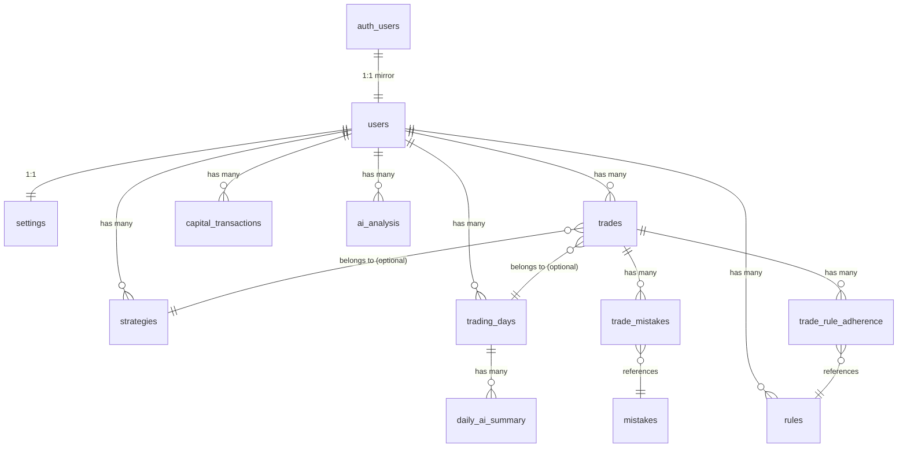

## 6. Database

### 6.1 Tables & Schema

All tables defined in [supabase-schema.sql](file:///c:/Games/New%20folder/supabase-schema.sql).

#### `public.users`
| Column | Type | Constraint |
|---|---|---|
| `id` | UUID | PK, FK → auth.users(id) ON DELETE CASCADE |
| `email` | TEXT | NOT NULL |
| `full_name` | TEXT | DEFAULT '' |
| `created_at` | TIMESTAMPTZ | DEFAULT NOW() |

#### `public.settings`
| Column | Type | Constraint |
|---|---|---|
| `id` | UUID | PK, DEFAULT gen_random_uuid() |
| `user_id` | UUID | FK → users(id), UNIQUE |
| `starting_capital` | NUMERIC | DEFAULT 10000 |
| `default_brokerage` | NUMERIC | DEFAULT 0 |
| `default_tax` | NUMERIC | DEFAULT 0 |
| `created_at` / `updated_at` | TIMESTAMPTZ | Auto-managed |

> [!NOTE]
> `starting_capital` exists in the schema but is **NOT editable via the Settings UI**. Capital is now managed dynamically through the `capital_transactions` table instead.

#### `public.strategies`
| Column | Type |
|---|---|
| `id` | UUID PK |
| `user_id` | UUID FK → users |
| `name` | TEXT NOT NULL |
| `market`, `conditions`, `entry_rules`, `stop_loss_rules`, `target_rules`, `notes` | TEXT DEFAULT '' |
| `created_at` | TIMESTAMPTZ |

#### `public.trades` (core table)
| Column | Type | Notes |
|---|---|---|
| `id` | UUID PK | |
| `user_id` | UUID FK → users | |
| `strategy_id` | UUID FK → strategies | ON DELETE SET NULL |
| `trading_day_id` | UUID FK → trading_days | ON DELETE SET NULL (added in V2) |
| `date` | DATE | NOT NULL |
| `symbol` | TEXT | NOT NULL |
| `trade_type` | TEXT | CHECK ('buy', 'sell') |
| `entry_price`, `exit_price`, `quantity` | NUMERIC | NOT NULL |
| `brokerage`, `taxes` | NUMERIC | DEFAULT 0, manual entry |
| `capital_used`, `capital_used_percent` | NUMERIC | Auto-calculated |
| `gross_pnl`, `net_pnl`, `trade_return_percent` | NUMERIC | Auto-calculated |
| `trade_review_score` | INTEGER | CHECK 1-10, nullable |
| `notes` | TEXT | |
| `created_at` | TIMESTAMPTZ | |

**Indexes**: `idx_trades_user_date` (user_id, date DESC), `idx_trades_date`, `idx_trades_strategy`, `idx_trades_user_id`, `idx_trades_user_date_symbol`, `idx_trades_trading_day`.

#### `public.rules`
| Column | Type |
|---|---|
| `id` | UUID PK |
| `user_id` | UUID FK → users |
| `category` | TEXT CHECK ('entry', 'exit', 'risk_management', 'psychology') |
| `title` | TEXT NOT NULL |
| `description` | TEXT |

#### `public.mistakes` (global, pre-populated)
Pre-populated with: FOMO, Overtrading, Revenge Trading, Early Exit, Late Entry, Ignored Stop Loss, Emotional Trading.

#### `public.trade_mistakes` (junction)
| Column | Type |
|---|---|
| `trade_id` | UUID FK → trades ON DELETE CASCADE |
| `mistake_id` | UUID FK → mistakes ON DELETE CASCADE |
| UNIQUE | (trade_id, mistake_id) |

#### `public.trade_rule_adherence` (junction)
| Column | Type |
|---|---|
| `trade_id` | UUID FK → trades ON DELETE CASCADE |
| `rule_id` | UUID FK → rules ON DELETE CASCADE |
| `status` | TEXT CHECK ('followed', 'broken') |
| UNIQUE | (trade_id, rule_id) |

#### `public.trading_days` (journal)
| Column | Type |
|---|---|
| `id` | UUID PK |
| `user_id` | UUID FK → auth.users |
| `date` | DATE NOT NULL |
| `symbol` | TEXT DEFAULT 'GENERAL' |
| `pre_market_completed` / `post_market_completed` | BOOLEAN DEFAULT FALSE |
| Pre-market fields | `market_bias`, `expected_market`, `watchlist` (TEXT[]), `important_levels` (JSONB), `market_factors` (TEXT[]), `factors_notes`, `plan_goal`, `plan_setup`, `plan_avoid`, `rules_for_today` |
| Post-market fields | `market_behaviour`, `plan_followed`, `biggest_mistake`, `biggest_achievement`, `biggest_learning`, `tomorrow_focus`, `overall_day_rating` (1-10), `reflection` |
| Score fields (future) | `daily_score`, `planning_score`, `execution_score`, `discipline_score` — all NULL, reserved for Phase 3+ |
| UNIQUE | (user_id, date, symbol) |

#### `public.daily_ai_summary`
| Column | Type |
|---|---|
| `trading_day_id` | UUID FK → trading_days |
| `user_id` | UUID FK → auth.users |
| `summary`, `strength`, `weakness` | TEXT |

> [!NOTE]
> This table is automatically populated by the AI during the Post-Market Review phase. It parses the Groq response (stripping markdown fences) and saves the structured daily AI summary.

#### `public.ai_analysis`
| Column | Type |
|---|---|
| `user_id` | UUID FK → auth.users |
| `content` | TEXT (full markdown analysis) |
| `trade_count` | INTEGER |
| `created_at` | TIMESTAMPTZ |

#### `public.capital_transactions`
| Column | Type |
|---|---|
| `user_id` | UUID FK → auth.users |
| `transaction_type` | TEXT CHECK ('deposit', 'withdrawal') |
| `amount` | NUMERIC CHECK (> 0) |
| `balance_after` | NUMERIC (running total of deposits - withdrawals: Net External Contributions) |
| `date` | TIMESTAMPTZ |
| `notes` | TEXT |

### 6.2 Entity Relationships



### 6.3 Row Level Security

All tables have RLS enabled. Every policy uses `auth.uid()` to scope data to the authenticated user:
- **users**: SELECT/UPDATE own row
- **settings, strategies, trades, rules, trading_days, ai_analysis, capital_transactions**: Full CRUD scoped by `user_id = auth.uid()`
- **mistakes**: Read-only for all authenticated users (`auth.role() = 'authenticated'`)
- **trade_mistakes, trade_rule_adherence**: Access controlled through a subquery checking `trades.user_id = auth.uid()`

### 6.4 Triggers

| Trigger | Table | Function | Action |
|---|---|---|---|
| `on_auth_user_created` | `auth.users` AFTER INSERT | `handle_new_user()` | Creates `public.users` row + default `settings` row (₹10,000 capital) |
| `settings_updated_at` | `public.settings` BEFORE UPDATE | `handle_updated_at()` | Sets `updated_at = NOW()` |

### 6.5 RPC Functions

| Function | Parameters | Returns | Purpose |
|---|---|---|---|
| `get_dashboard_stats(p_user_id)` | UUID | JSON | Aggregated stats: total/today P&L, win/loss counts, gross profit/loss, net funding from capital_transactions, current capital, overall ROI |
| `get_equity_curve(p_user_id)` | UUID | TABLE (trade_date, daily_net_pnl, daily_gross_pnl) | Daily P&L sums grouped by date, ordered ASC |
| `insert_trade_atomic(p_trade_data, p_mistake_ids, p_rule_adherences)` | JSONB, UUID[], JSONB | UUID | Atomic INSERT of trade + mistake links + rule adherence in one transaction |
| `update_trade_atomic(p_trade_id, p_trade_data, p_mistake_ids, p_rule_adherences)` | UUID, JSONB, UUID[], JSONB | VOID | Atomic UPDATE trade + DELETE old mistakes/rules + re-INSERT new ones |
| `get_capital_at_date(p_user_id, p_date)` | UUID, DATE | NUMERIC | Returns `balance_after` (Net External Contributions) from latest capital_transaction at or before date + cumulative P&L up to date (Equity) |

---


## 7. APIs & Data Access

> [!IMPORTANT]
> TradeOS has **no REST API endpoints** in the traditional sense. All data access is done via:
> 1. **Supabase client queries** (server-side) in Server Components
> 2. **Next.js Server Actions** for mutations
> 3. **Supabase RPC calls** for complex aggregations
> 4. **Groq API** (client-side fetch) for AI analysis

### 7.1 Server Action Endpoints

| Action | Method | Input | Processing | DB Operation | Response | Errors |
|---|---|---|---|---|---|---|
| `createTrade` | Server Action | FormData (date, symbol, type, prices, qty, brokerage, taxes, strategy, score, mistakes, rules) | Validates prices > 0, calls `get_capital_at_date` RPC, `calculateTradeFields()`, checks for journal | `insert_trade_atomic` RPC, then UPDATE `trading_day_id` | `{ needsJournal, trade }` | Throws Error on validation/DB failure |
| `updateTrade` | Server Action | FormData + hidden `id` | Same as create | `update_trade_atomic` RPC, UPDATE `trading_day_id` | `{ needsJournal, trade }` | Throws Error |
| `deleteTrade` | Server Action | FormData with `id` | Validate user | DELETE FROM trades WHERE id AND user_id | void | Throws Error |
| `addCapitalTransaction` | Server Action | FormData (type, amount, date, notes) | Validate amount > 0 | INSERT, then recompute all balances | void | Throws Error |
| `deleteCapitalTransaction` | Server Action | id (string) | Validate user | DELETE, then recompute all balances | void | Throws Error |
| `createStrategy` | Server Action | FormData (name, market, conditions, etc.) | — | INSERT into strategies | void | Throws Error |
| `deleteStrategy` | Server Action | FormData with `id` | — | DELETE FROM strategies WHERE id AND user_id | void | Throws Error |
| `createRule` | Server Action | FormData (category, title, description) | — | INSERT into rules | void | Throws Error |
| `deleteRule` | Server Action | FormData with `id` | — | DELETE FROM rules WHERE id AND user_id | void | Throws Error |
| `upsertTradingDay` | Server Action | `{ date, symbol, formType, fields? }` | Merge fields, set completion flags | UPSERT with onConflict | Returned row | Throws Error |
| `updateSettings` | Server Action | FormData (full_name, brokerage, tax) | — | UPDATE users + UPSERT settings | `{ success, error?, message? }` | Returns error state |
| `exportAccountData` | Server Action | — | — | SELECT * from trades, strategies, rules, mistakes | JSON data | Throws Error |
| `resetAccountData` | Server Action | — | — | DELETE all user data, reset settings | void | Throws Error |

### 7.2 Groq API Call (AI Analyst)

```
POST https://api.groq.com/openai/v1/chat/completions
Headers: Authorization: Bearer ${GROQ_API_KEY}
Body: {
  model: "openai/gpt-oss-120b",
  messages: [{ role: "system", content: systemPrompt }, { role: "user", content: userPrompt }],
  temperature: 0.4,
  max_tokens: 4096
}
Response: data.choices[0].message.content (markdown string)
```

### 7.3 Market Data Fetching (Yahoo Finance)

```
GET https://query1.finance.yahoo.com/v8/finance/chart/{symbol}
Headers: None
Options: { cache: 'no-store', signal: AbortSignal.timeout(5000) }
Used for: Fetching NIFTY and BANKNIFTY 5-day history in `src/lib/market-data.ts` to provide market context to the AI Analyst.
```

### 7.4 Auth Callback Route

```
GET /auth/callback?code=<code>&next=<path>
  → supabase.auth.exchangeCodeForSession(code)
  → Redirect to `next` param
```

---

