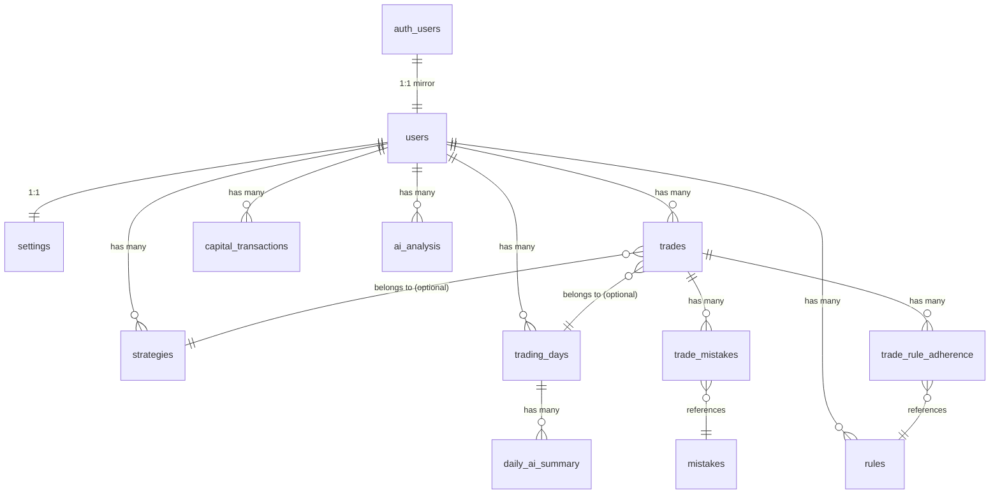

# TradeOS — Complete Technical Documentation

> Reverse-engineered from source code. Every file name, function name, route, variable, table, formula, and data flow described below is taken directly from the actual codebase.

---

## Table of Contents

1. [Project Overview](#1-project-overview)
2. [Complete Workflow](#2-complete-workflow)
3. [Features](#3-features)
4. [Frontend](#4-frontend)
5. [Backend](#5-backend)
6. [Database](#6-database)
7. [APIs & Data Access](#7-apis--data-access)
8. [Calculations & Business Logic](#8-calculations--business-logic)
9. [End-to-End Workflows](#9-end-to-end-workflows)
10. [Validation & Edge Cases](#10-validation--edge-cases)
11. [Project Structure](#11-project-structure)
12. [Final System Map](#12-final-system-map)

---

## 1. Project Overview

### Purpose
TradeOS is a **personal trading journal and performance tracker** built specifically for **Indian F&O (Futures & Options) traders**. It allows traders to record trades, plan daily sessions, review mistakes, track capital, enforce trading rules, and receive AI-powered analysis — all from a single dark-themed workspace.

### Target Users
Individual Indian F&O traders who trade instruments on the NSE (NIFTY, BANKNIFTY, individual stock F&O). The app is denominated in INR (₹) and ships with 120+ pre-loaded NSE symbols.

### Main Features
| Feature | Description |
|---|---|
| Dashboard | KPI cards, equity curve, monthly P&L chart, weekday accuracy, today's progress tracker, capital ledger |
| Trade Journal | Log trades with auto-calculated P&L, brokerage/taxes, capital used %, return %, mistakes, rule adherence |
| Daily Journal | Per-symbol pre-market planning + post-market review workflow with structured forms |
| Calendar | Monthly heatmap of daily P&L, color-coded days, drill-down into individual trades |
| Strategies | Define strategies with conditions, entry/exit/SL/target rules, track win rate & P&L per strategy |
| Rules | Create entry/exit/risk/psychology rules, check adherence per trade |
| Analytics | Win rate, profit factor, avg win/loss, strategy breakdown, cost analysis |
| Monthly Reports | Isolated monthly performance with compounding balance tracking |
| AI Trade Analyst | Llama 3.3 70B via Groq API — data-driven analysis of trading performance |
| Settings | Profile, default brokerage/tax, capital management, account reset with CSV export |

### Tech Stack

| Layer | Technology |
|---|---|
| Framework | Next.js 15 (App Router, Server Components, Server Actions) |
| Language | TypeScript |
| Styling | Tailwind CSS v4 |
| Database & Auth | Supabase (PostgreSQL, Row Level Security, Auth) |
| Charts | Recharts |
| AI | Groq (Llama 3.3 70B) via client-side `fetch` |
| Icons | Lucide React |
| Date Utilities | date-fns |
| UI Primitives | shadcn/ui (Base UI) — 21 components |

### Architecture

```
┌───────────────────────────────────────────────────────────────┐
│                        Browser (Client)                       │
│  React 19 · Tailwind · Recharts · Lucide · date-fns          │
│  Client Components: TradeForm, AiAnalyst, SettingsForm, etc.  │
├───────────────────────────────────────────────────────────────┤
│                    Next.js 15 App Router                      │
│  Server Components (pages) · Server Actions · Middleware      │
│  @supabase/ssr cookie management                              │
├───────────────────────────────────────────────────────────────┤
│                     Supabase (BaaS)                           │
│  Auth (email/password) · PostgreSQL · RLS · RPC functions     │
├───────────────────────────────────────────────────────────────┤
│                     Groq API (External)                       │
│  Llama 3.3 70B — client-side fetch from browser               │
└───────────────────────────────────────────────────────────────┘
```

> [!NOTE]
> There is **no custom backend server**. All "backend" logic is implemented via Next.js Server Actions and Supabase RPC functions. The AI feature calls Groq directly from the client browser.

---

## 2. Complete Workflow

### Application Startup

1. User visits `/` → [page.tsx](file:///c:/Games/New%20folder/src/app/page.tsx) checks `isSupabaseConfigured()` → if not configured, redirects to `/login`
2. If configured, calls `getSupabaseSession()` → if user exists, redirect to `/dashboard`; otherwise `/login`
3. **Middleware** ([middleware.ts](file:///c:/Games/New%20folder/src/middleware.ts)) runs on every protected route:
   - Defines `protectedRoutes`: `/dashboard`, `/trades`, `/calendar`, `/strategies`, `/rules`, `/analytics`, `/reports`, `/settings`, `/journal`, `/analysis`
   - Creates a Supabase server client with cookie-based auth
   - Calls `supabase.auth.getUser()` to validate the JWT token against Supabase Auth
   - If no user + protected route → redirect to `/login?redirectedFrom=<path>`
   - If user + on `/login` → redirect to `/dashboard`
   - Syncs auth cookies between request and response

### Authentication Flow

#### Sign Up
```
User fills form (fullName, email, password)
  → Client-side validation (email regex, password: 8+ chars, uppercase, lowercase, digit)
  → supabase.auth.signUp({ email, password, options: { data: { full_name }, emailRedirectTo } })
  → Supabase creates auth.users row
  → DB trigger `on_auth_user_created` fires `handle_new_user()`
    → INSERT into public.users (id, email, full_name)
    → INSERT into public.settings (user_id, starting_capital=10000, default_brokerage=0, default_tax=0)
  → If session returned immediately: redirect to /dashboard
  → If email confirmation required: show "Check your email" message
```

#### Sign In
```
User fills form (email, password)
  → Client-side email format validation
  → supabase.auth.signInWithPassword({ email, password })
  → On success: window.location.href = redirectedFrom (default: /dashboard)
  → On error: display error message
```

#### Email Confirmation Callback
```
User clicks email link → /auth/callback?code=<code>&next=<path>
  → route.ts GET handler
  → supabase.auth.exchangeCodeForSession(code)
  → Redirect to `next` param (default: /dashboard)
```

#### Sign Out
```
SignOutButton component → supabase.auth.signOut()
  → window.location.href = "/login" (forces full reload to clear router cache)
```

### Dashboard Layout Loading

When any `/dashboard/*` route loads ([layout.tsx](file:///c:/Games/New%20folder/src/app/(dashboard)/layout.tsx)):

```
getSupabaseSession() → validate user
  → If no user: redirect("/login")
  → Fetch profile: supabase.from("users").select("full_name,email").eq("id", user.id)
  → Render:
    ├── <NavigationProgress /> (top loading bar)
    ├── <Sidebar user={sidebarUser} /> (desktop, 288px width)
    └── <div>
        ├── <Header user={sidebarUser} /> (mobile sidebar trigger + title)
        └── <main>{children}</main>
```

---

## 3. Features

### 3.1 Dashboard
**File**: [dashboard/page.tsx](file:///c:/Games/New%20folder/src/app/(dashboard)/dashboard/page.tsx)

**What it does**: Shows a complete overview of the trader's account — current capital, today's P&L, KPI cards (ROI, win rate, profit factor, avg win/loss), weekday accuracy heatmap, equity curve chart, and monthly P&L bar chart.

**Data sources** (all fetched in parallel via `Promise.all`):
- `supabase.rpc("get_dashboard_stats", { p_user_id })` — aggregated stats from DB
- `supabase.rpc("get_equity_curve", { p_user_id })` — daily P&L sums
- `supabase.from("trades").select("date, net_pnl")` — raw trades for weekday analysis
- `supabase.from("capital_transactions").select("*").limit(10)` — recent funding transactions

**KPI Calculations** (performed server-side in the page component):
- `currentCapital = netFunding + totalNetPnl`
- `overallReturn = (totalNetPnl / netFunding) * 100`
- `todayReturn = todayNetPnl / yesterdayEndingBalance * 100`
- `yesterdayEndingBalance = netFunding + pnlBeforeToday`
- `profitFactor = |grossProfit / grossLoss|` (999 if no losses)
- `winRate = (winningTrades / totalTrades) * 100`
- `avgWin = grossProfit / winsCount`
- `avgLoss = |grossLoss| / lossesCount`

**Sub-components**:
- `<TodayTradingStatus />` — server component showing today's journal progress (planning → trading → reviewing → overall %)
- `<KpiCard />` — reusable card with title, value, icon, tone coloring, and optional tooltip
- `<CapitalLedgerPanel />` — sheet/drawer with deposit/withdrawal form and transaction history table
- `<EquityCurve />` — Recharts `AreaChart` (dynamic import)
- `<MonthlyPnlChart />` — Recharts `BarChart` (dynamic import)

---

### 3.2 Trade Journal
**Files**: [trades/page.tsx](file:///c:/Games/New%20folder/src/app/(dashboard)/trades/page.tsx), [trades/actions.ts](file:///c:/Games/New%20folder/src/app/(dashboard)/trades/actions.ts)

**What it does**: Main trade logging interface. Shows stats (total trades, net P&L, today's P&L %), a paginated table of all trades, and an "Add Trade" dialog.

**Pagination**: 25 items per page. Uses `searchParams.page` and Supabase `.range(from, to)`.

**Trade Form** ([trade-form.tsx](file:///c:/Games/New%20folder/src/components/trades/trade-form.tsx)):
- Fields: date, symbol (with NSE autocomplete datalist), buy/sell toggle, entry price, exit price, quantity, capital used (manual override), brokerage (default from settings), taxes (default from settings), strategy (dropdown), review score (1-10 slider), mistakes (checkboxes), rule adherence (radio: followed/broken/N/A), notes
- **Live preview**: as user types prices/quantity, `calculateTradeFields()` runs via `useMemo` and shows Gross P&L, Net P&L, Capital Used %, Trade Return %, and Result badge (WIN/LOSS/BREAKEVEN)
- Same form used for both Create and Edit (determined by `initialData` prop)

**Journal Gate**: When saving a trade, the server action checks for an existing `trading_days` row matching (user_id, date, symbol). If none exists, it returns `{ needsJournal: true }` and the client shows a `window.confirm()` asking to create one. If confirmed, it calls `upsertTradingDay()` first, then retries the trade save.

---

### 3.3 Daily Journal
**Files**: [journal/page.tsx](file:///c:/Games/New%20folder/src/app/(dashboard)/journal/page.tsx), [journal/actions.ts](file:///c:/Games/New%20folder/src/app/(dashboard)/journal/actions.ts)

**What it does**: A per-day, per-symbol structured trading journal with three phases:
1. **Pre-Market Plan** — market bias (bullish/bearish/neutral), expected market (trend/range/volatile), important price levels (custom JSON editor), market factors (checkboxes: Price Action, OI, PCR, etc.), watchlist, trading plan (goal/setup/avoid), rules reminder
2. **Trade Execution** — embedded `<TradeForm>` pre-filled with date and symbol, timeline view showing trade count and net P&L
3. **Post-Market Review** — market behaviour check, plan adherence check, biggest mistake (from global mistakes list), biggest achievement/learning (free text), day rating (1-10 slider), reflection, tomorrow's focus

**Status Machine** ([computeStatus.ts](file:///c:/Games/New%20folder/src/lib/journal/computeStatus.ts)):
```
if (post_market_completed) → "completed"
if (pre_market_completed && hasTrades) → "reviewing"
if (pre_market_completed) → "trading"
else → "planning"
```

**Navigation**: Date-based with "Yesterday", "Today", "Tomorrow" links. Symbol tabs for multiple instruments on the same day.

**Data model**: Uses `trading_days` table with `UNIQUE(user_id, date, symbol)` constraint. All saves use `upsertTradingDay()` with `onConflict: "user_id,date,symbol"`.

---

### 3.4 Calendar
**File**: [calendar/page.tsx](file:///c:/Games/New%20folder/src/app/(dashboard)/calendar/page.tsx)

**What it does**: Monthly calendar heatmap. Each day cell is color-coded:
- Green border/bg = positive net P&L
- Red border/bg = negative net P&L
- Amber border/bg = breakeven
- Star icon = post-market completed
- Book icon = pre-market completed but post not yet

**Drill-down**: Clicking a day shows trade details (symbol, type, qty, entry/exit, capital, return, net P&L, result badge) + journal summary (symbol, bias, execution, day rating). Links to journal page.

**Summary section**: Shows monthly Net P&L, Gross P&L, brokerage, and regulatory charges.

---

### 3.5 Strategies
**Files**: [strategies/page.tsx](file:///c:/Games/New%20folder/src/app/(dashboard)/strategies/page.tsx), [strategies/actions.ts](file:///c:/Games/New%20folder/src/app/(dashboard)/strategies/actions.ts)

**What it does**: CRUD for trading strategies. Each strategy card shows computed stats:
- Total trades using that strategy (filtered from all user trades by `strategy_id`)
- Win rate: `calculateWinRate(strategyTrades)`
- Net P&L: `sum(strategyTrades.net_pnl)`

**Fields**: name (required), market, conditions, entry rules, stop loss rules, target rules, notes.

---

### 3.6 Rules
**Files**: [rules/page.tsx](file:///c:/Games/New%20folder/src/app/(dashboard)/rules/page.tsx), [rules/actions.ts](file:///c:/Games/New%20folder/src/app/(dashboard)/rules/actions.ts)

**What it does**: CRUD for trading rules organized by category: `entry`, `exit`, `risk_management`, `psychology`.

**Rule Checklist Card** ([rule-checklist-card.tsx](file:///c:/Games/New%20folder/src/components/rules/rule-checklist-card.tsx)): Interactive card with client-side checkbox toggle (visual only — the checked state is not persisted to DB; it's a daily self-check tool). Delete via form action.

---

### 3.7 Analytics
**File**: [analytics/page.tsx](file:///c:/Games/New%20folder/src/app/(dashboard)/analytics/page.tsx)

**What it does**: Deep analytics across all trades:
- Top-level: Total Trades, Win Rate, Average Return %, Profit Factor, Total Costs
- Performance Metrics: Winning/Losing trade counts, Average Win, Average Loss, Total Brokerage, Total Taxes
- Strategy Analytics: Groups trades by `strategies.name`, shows count and net P&L per strategy

**All calculations done server-side** by fetching all trades and computing in the React server component.

---

### 3.8 Monthly Reports
**File**: [reports/page.tsx](file:///c:/Games/New%20folder/src/app/(dashboard)/reports/page.tsx)

**What it does**: Isolated monthly performance view with **compounding balance tracking**.

**Key calculation**: Starting balance for month M = original capital + sum of all net P&L before month M.

```
prevCumulativePnl = sum(net_pnl) WHERE date <= lastDayOfPreviousMonth
monthStartingBalance = originalCapital + prevCumulativePnl
monthNetPnl = sum(net_pnl) WHERE date IN currentMonth
monthEndingBalance = monthStartingBalance + monthNetPnl
monthReturn = (monthNetPnl / monthStartingBalance) * 100
```

**Highlights**: Best trade, worst trade, most used strategy, most common mistake (resolved by joining `trade_mistakes` → `mistakes.name`).

---

### 3.9 AI Trade Analyst
**Files**: [analysis/page.tsx](file:///c:/Games/New%20folder/src/app/(dashboard)/analysis/page.tsx), [ai-analyst.tsx](file:///c:/Games/New%20folder/src/components/analysis/ai-analyst.tsx)

**What it does**: Sends trade data and week-over-week comparisons to Groq (`openai/gpt-oss-120b`) for a highly structured, data-driven analysis of trader performance.

**How it works**:
1. Page (server component) fetches trades, strategies, rules, mistakes, settings, and last saved analysis.
2. `<AiAnalyst>` (client component) receives all data as props.
3. `computeWeeklyStats()` partitions trades into "this week" vs "last week" to render visual Progress Cards and injects comparison data into the prompt.
4. `buildPrompts()` function computes summary stats (win rate, P&L, best/worst trade, strategy breakdown, etc.) and formats them into a structured text prompt.
5. Sends `POST` to `https://api.groq.com/openai/v1/chat/completions` with:
   - `model: "openai/gpt-oss-120b"`
   - `temperature: 0.4` (Low temperature for strictly data-driven, non-hallucinated feedback)
   - `max_tokens: 4096`
   - System prompt defining the analyst persona (explicitly forbidding Markdown tables in favor of bullet points for UI compatibility).
   - User prompt with all trading data, plus Market Context (Nifty/BankNifty 5-day ranges).
6. Response is parsed into 7 sections: "What's working", "Where I'm losing money", "My biggest weakness", "Strategy performance", "Specific suggestions", "This week's focus", and "Progress since last week".
7. Result is saved to `ai_analysis` table in Supabase.
8. Each section is rendered with unique color theming and custom markdown parsing (bullet points, bold text).

**Gating & Rate Limits**:
- Requires `NEXT_PUBLIC_GROQ_API_KEY` in env.
- Requires minimum 5 trades to unlock.
- **Weekly Lock**: Once generated for the current week (resets Sunday at midnight), the "Regenerate Analysis" button is disabled to enforce a disciplined weekly review routine.

---

### 3.10 Settings
**Files**: [settings/page.tsx](file:///c:/Games/New%20folder/src/app/(dashboard)/settings/page.tsx), [settings/actions.ts](file:///c:/Games/New%20folder/src/app/(dashboard)/settings/actions.ts)

**What it does**:
- **Profile**: Edit full name (email is read-only)
- **Defaults**: Default brokerage and default tax per trade
- **Capital Management**: Link to dashboard capital ledger
- **Account Reset**: Two-step destructive action — must download CSV backup first, then type "RESET" to confirm

**Reset action** deletes: trades, strategies, rules, capital_transactions; resets brokerage/tax to 0 in settings. Profile and auth remain intact.

**Export** generates a CSV file with columns: Date, Symbol, Type, Strategy, Entry Price, Exit Price, Quantity, Capital Used, Gross P&L, Brokerage, Taxes, Net P&L, Return %, Notes.

---

## 4. Frontend

### 4.1 Page Map

| Route | File | Type | Key Components |
|---|---|---|---|
| `/` | `src/app/page.tsx` | Server | Redirect logic only |
| `/login` | `src/app/login/page.tsx` | Client | `LoginContent` |
| `/auth/callback` | `src/app/auth/callback/route.ts` | Route Handler | OAuth code exchange |
| `/dashboard` | `src/app/(dashboard)/dashboard/page.tsx` | Server | `DashboardContent`, `TodayTradingStatus`, `EquityCurve`, `MonthlyPnlChart`, `CapitalLedgerPanel`, `KpiCard` |
| `/trades` | `src/app/(dashboard)/trades/page.tsx` | Server | `TradesContent`, `TradeForm`, `TradeTable` |
| `/calendar` | `src/app/(dashboard)/calendar/page.tsx` | Server | `MonthSelector`, calendar grid, trade detail cards |
| `/strategies` | `src/app/(dashboard)/strategies/page.tsx` | Server | Strategy cards, create form |
| `/rules` | `src/app/(dashboard)/rules/page.tsx` | Server | `RuleChecklistCard`, create form |
| `/journal` | `src/app/(dashboard)/journal/page.tsx` | Server | `SymbolJournalPanel`, `PreMarketForm`, `PostMarketForm`, `DayTimeline`, `DayOverview`, `TradeForm` |
| `/analytics` | `src/app/(dashboard)/analytics/page.tsx` | Server | `Metric`, `groupByStrategy` |
| `/reports` | `src/app/(dashboard)/reports/page.tsx` | Server | `ReportContent`, `StatCard`, `TradeHighlight` |
| `/analysis` | `src/app/(dashboard)/analysis/page.tsx` | Server | `AiAnalyst` |
| `/settings` | `src/app/(dashboard)/settings/page.tsx` | Server | `SettingsForm`, `ResetAccountCard` |

### 4.2 Component Architecture

#### Layout Components
- **`Sidebar`** ([sidebar.tsx](file:///c:/Games/New%20folder/src/components/sidebar.tsx)): 10-item navigation, user avatar with initials, sign-out button. Desktop: sticky 288px sidebar. Mobile: Sheet (slide-out drawer) via `MobileSidebar`.
- **`Header`** ([header.tsx](file:///c:/Games/New%20folder/src/components/header.tsx)): Sticky top bar with mobile sidebar trigger. Shows current page title from a pathname-to-title map.
- **`NavigationProgress`** ([navigation-progress.tsx](file:///c:/Games/New%20folder/src/components/navigation-progress.tsx)): Top loading bar indicator during Next.js page transitions.

#### Client Components (interactive state)

| Component | File | State Managed |
|---|---|---|
| `TradeForm` | `trades/trade-form.tsx` | `open`, `tradeType`, `entryPrice`, `exitPrice`, `quantity`, `brokerage`, `taxes`, `reviewScore`, `manualCapitalUsed` |
| `AiAnalyst` | `analysis/ai-analyst.tsx` | `analysis`, `tradeCount`, `analysisDate`, `loading`, `error` |
| `SettingsForm` | `settings/settings-form.tsx` | `useActionState` for form state |
| `ResetAccountCard` | `settings/reset-account-card.tsx` | `confirmText`, `loading`, `downloaded` |
| `CapitalLedgerPanel` | `dashboard/capital-ledger-panel.tsx` | `isDialogOpen`, `error` |
| `SymbolJournalPanel` | `journal/symbol-journal-panel.tsx` | Collapsible section open states |
| `PreMarketForm` | `journal/pre-market-form.tsx` | `isOpen`, `isPending`, `watchlistStr` |
| `PostMarketForm` | `journal/post-market-form.tsx` | `isOpen`, `isPending`, `rating` |
| `RuleChecklistCard` | `rules/rule-checklist-card.tsx` | `checked` (client-only toggle) |
| `SignOutButton` | `sign-out-button.tsx` | `isLoading` |
| `LoginContent` | `login/page.tsx` | `mode`, `email`, `password`, `fullName`, `message`, `error`, `isSubmitting` |
| `Sidebar` (nav loading) | `sidebar.tsx` | `loadingHref` |

### 4.3 UI Primitives (shadcn/ui)

Located in `src/components/ui/`: `avatar`, `badge`, `button`, `calendar`, `card`, `checkbox`, `command`, `dialog`, `dropdown-menu`, `input`, `label`, `popover`, `scroll-area`, `select`, `separator`, `sheet`, `slider`, `table`, `tabs`, `textarea`, `tooltip` — 21 total.

### 4.4 Styling

- Global dark theme: `<html className="dark">` in root layout
- Base background: `bg-slate-950` with `radial-gradient` overlays
- Accent color: `emerald-400` (green) for profit/active states
- Loss color: `red-400` / `rose-400`
- Neutral color: `amber-400` for breakeven/warnings
- All formatting uses INR locale via `Intl.NumberFormat("en-IN", { style: "currency", currency: "INR" })`

### 4.5 Loading States

Every page in `(dashboard)/` has either:
- A top-level `loading.tsx` (spinner with "Loading Workspace..." text)
- `<Suspense>` boundaries with custom skeleton components (pulse-animated placeholder cards/charts)

---

## 5. Backend

### 5.1 Server Actions

There is **no Express/Fastify server**. All mutations are Next.js **Server Actions** (`"use server"`).

#### Trade Actions — [trades/actions.ts](file:///c:/Games/New%20folder/src/app/(dashboard)/trades/actions.ts)

| Function | Trigger | What it does |
|---|---|---|
| `createTrade(formData)` | TradeForm submit | Validates prices > 0, calls `get_capital_at_date` RPC, runs `calculateTradeFields()`, checks for existing `trading_days` row, calls `insert_trade_atomic` RPC, links trade to journal, revalidates `/dashboard`, `/trades`, `/calendar` |
| `updateTrade(formData)` | TradeForm edit submit | Same flow as create but calls `update_trade_atomic` RPC |
| `deleteTrade(formData)` | Delete button in TradeTable | `supabase.from("trades").delete().eq("id", id).eq("user_id", user.id)` |

#### Capital Actions — [dashboard/capital-actions.ts](file:///c:/Games/New%20folder/src/app/(dashboard)/dashboard/capital-actions.ts)

| Function | Trigger | What it does |
|---|---|---|
| `addCapitalTransaction(formData)` | Capital ledger dialog submit | Validates amount > 0, inserts with dummy `balance_after=0`, then calls `recomputeCapitalBalances()` |
| `deleteCapitalTransaction(id)` | Delete button in ledger | Deletes row, then calls `recomputeCapitalBalances()` |
| `recomputeCapitalBalances(userId, supabase)` | Called after add/delete | Fetches ALL transactions ordered by date ASC, iterates computing running balance (deposit = +, withdrawal = −), batch-updates any rows where `balance_after` differs |

#### Strategy Actions — [strategies/actions.ts](file:///c:/Games/New%20folder/src/app/(dashboard)/strategies/actions.ts)

| Function | Trigger | What it does |
|---|---|---|
| `createStrategy(formData)` | Strategy form submit | INSERT into `strategies` |
| `deleteStrategy(formData)` | Delete button | DELETE from `strategies` WHERE id AND user_id |

#### Rule Actions — [rules/actions.ts](file:///c:/Games/New%20folder/src/app/(dashboard)/rules/actions.ts)

| Function | Trigger | What it does |
|---|---|---|
| `createRule(formData)` | Rule form submit | INSERT into `rules` |
| `deleteRule(formData)` | Delete button | DELETE from `rules` WHERE id AND user_id |

#### Journal Actions — [journal/actions.ts](file:///c:/Games/New%20folder/src/app/(dashboard)/journal/actions.ts)

| Function | Trigger | What it does |
|---|---|---|
| `upsertTradingDay(input)` | Pre-market save, post-market save, new symbol creation, trade gate | UPSERT into `trading_days` with `onConflict: "user_id,date,symbol"`. Sets `pre_market_completed=true` or `post_market_completed=true` based on `formType`. |

#### Settings Actions — [settings/actions.ts](file:///c:/Games/New%20folder/src/app/(dashboard)/settings/actions.ts)

| Function | Trigger | What it does |
|---|---|---|
| `updateSettings(prevState, formData)` | Settings form submit | Updates `users.full_name`, upserts `settings.default_brokerage/default_tax` |
| `exportAccountData()` | Export button | Fetches all trades, strategies, rules, mistakes and returns as JSON |
| `resetAccountData()` | Reset confirm | Deletes all trades, strategies, rules, capital_transactions; resets settings defaults |

### 5.2 Session Management

**[session.ts](file:///c:/Games/New%20folder/src/lib/supabase/session.ts)**: `getSupabaseSession()` is a `React.cache()`-wrapped function that creates a Supabase server client and calls `getUser()`. Being cached, it deduplicates within a single request — called once per render tree regardless of how many components need it.

### 5.3 Supabase Client Creation

| Client | File | Usage |
|---|---|---|
| Server client | [server.ts](file:///c:/Games/New%20folder/src/lib/supabase/server.ts) | Server Components, Server Actions — uses `cookies()` from `next/headers` |
| Browser client | [client.ts](file:///c:/Games/New%20folder/src/lib/supabase/client.ts) | Client Components — `createBrowserClient()` |
| Middleware client | [middleware.ts](file:///c:/Games/New%20folder/src/middleware.ts) | Inline creation with cookie forwarding between request/response |

### 5.4 Config Check

[config.ts](file:///c:/Games/New%20folder/src/lib/supabase/config.ts): `isSupabaseConfigured()` validates:
- `NEXT_PUBLIC_SUPABASE_URL` exists and is a valid HTTP URL
- `NEXT_PUBLIC_SUPABASE_ANON_KEY` exists and is longer than 40 characters

---

## 6. Database

### 6.1 Tables & Schema

All tables defined in [supabase-schema.sql](file:///c:/Games/New%20folder/supabase-schema.sql).

#### `public.users`
| Column | Type | Constraint |
|---|---|---|
| `id` | UUID | PK, FK → auth.users(id) ON DELETE CASCADE |
| `email` | TEXT | NOT NULL |
| `full_name` | TEXT | DEFAULT '' |
| `created_at` | TIMESTAMPTZ | DEFAULT NOW() |

#### `public.settings`
| Column | Type | Constraint |
|---|---|---|
| `id` | UUID | PK, DEFAULT gen_random_uuid() |
| `user_id` | UUID | FK → users(id), UNIQUE |
| `starting_capital` | NUMERIC | DEFAULT 10000 |
| `default_brokerage` | NUMERIC | DEFAULT 0 |
| `default_tax` | NUMERIC | DEFAULT 0 |
| `created_at` / `updated_at` | TIMESTAMPTZ | Auto-managed |

> [!NOTE]
> `starting_capital` exists in the schema but is **NOT editable via the Settings UI**. Capital is now managed dynamically through the `capital_transactions` table instead.

#### `public.strategies`
| Column | Type |
|---|---|
| `id` | UUID PK |
| `user_id` | UUID FK → users |
| `name` | TEXT NOT NULL |
| `market`, `conditions`, `entry_rules`, `stop_loss_rules`, `target_rules`, `notes` | TEXT DEFAULT '' |
| `created_at` | TIMESTAMPTZ |

#### `public.trades` (core table)
| Column | Type | Notes |
|---|---|---|
| `id` | UUID PK | |
| `user_id` | UUID FK → users | |
| `strategy_id` | UUID FK → strategies | ON DELETE SET NULL |
| `trading_day_id` | UUID FK → trading_days | ON DELETE SET NULL (added in V2) |
| `date` | DATE | NOT NULL |
| `symbol` | TEXT | NOT NULL |
| `trade_type` | TEXT | CHECK ('buy', 'sell') |
| `entry_price`, `exit_price`, `quantity` | NUMERIC | NOT NULL |
| `brokerage`, `taxes` | NUMERIC | DEFAULT 0, manual entry |
| `capital_used`, `capital_used_percent` | NUMERIC | Auto-calculated |
| `gross_pnl`, `net_pnl`, `trade_return_percent` | NUMERIC | Auto-calculated |
| `trade_review_score` | INTEGER | CHECK 1-10, nullable |
| `notes` | TEXT | |
| `created_at` | TIMESTAMPTZ | |

**Indexes**: `idx_trades_user_date` (user_id, date DESC), `idx_trades_date`, `idx_trades_strategy`, `idx_trades_user_id`, `idx_trades_user_date_symbol`, `idx_trades_trading_day`.

#### `public.rules`
| Column | Type |
|---|---|
| `id` | UUID PK |
| `user_id` | UUID FK → users |
| `category` | TEXT CHECK ('entry', 'exit', 'risk_management', 'psychology') |
| `title` | TEXT NOT NULL |
| `description` | TEXT |

#### `public.mistakes` (global, pre-populated)
Pre-populated with: FOMO, Overtrading, Revenge Trading, Early Exit, Late Entry, Ignored Stop Loss, Emotional Trading.

#### `public.trade_mistakes` (junction)
| Column | Type |
|---|---|
| `trade_id` | UUID FK → trades ON DELETE CASCADE |
| `mistake_id` | UUID FK → mistakes ON DELETE CASCADE |
| UNIQUE | (trade_id, mistake_id) |

#### `public.trade_rule_adherence` (junction)
| Column | Type |
|---|---|
| `trade_id` | UUID FK → trades ON DELETE CASCADE |
| `rule_id` | UUID FK → rules ON DELETE CASCADE |
| `status` | TEXT CHECK ('followed', 'broken') |
| UNIQUE | (trade_id, rule_id) |

#### `public.trading_days` (journal)
| Column | Type |
|---|---|
| `id` | UUID PK |
| `user_id` | UUID FK → auth.users |
| `date` | DATE NOT NULL |
| `symbol` | TEXT DEFAULT 'GENERAL' |
| `pre_market_completed` / `post_market_completed` | BOOLEAN DEFAULT FALSE |
| Pre-market fields | `market_bias`, `expected_market`, `watchlist` (TEXT[]), `important_levels` (JSONB), `market_factors` (TEXT[]), `factors_notes`, `plan_goal`, `plan_setup`, `plan_avoid`, `rules_for_today` |
| Post-market fields | `market_behaviour`, `plan_followed`, `biggest_mistake`, `biggest_achievement`, `biggest_learning`, `tomorrow_focus`, `overall_day_rating` (1-10), `reflection` |
| Score fields (future) | `daily_score`, `planning_score`, `execution_score`, `discipline_score` — all NULL, reserved for Phase 3+ |
| UNIQUE | (user_id, date, symbol) |

#### `public.daily_ai_summary`
| Column | Type |
|---|---|
| `trading_day_id` | UUID FK → trading_days |
| `user_id` | UUID FK → auth.users |
| `summary`, `strength`, `weakness` | TEXT |

> [!NOTE]
> This table is automatically populated by the AI during the Post-Market Review phase. It parses the Groq response (stripping markdown fences) and saves the structured daily AI summary.

#### `public.ai_analysis`
| Column | Type |
|---|---|
| `user_id` | UUID FK → auth.users |
| `content` | TEXT (full markdown analysis) |
| `trade_count` | INTEGER |
| `created_at` | TIMESTAMPTZ |

#### `public.capital_transactions`
| Column | Type |
|---|---|
| `user_id` | UUID FK → auth.users |
| `transaction_type` | TEXT CHECK ('deposit', 'withdrawal') |
| `amount` | NUMERIC CHECK (> 0) |
| `balance_after` | NUMERIC (running total of deposits - withdrawals: Net External Contributions) |
| `date` | TIMESTAMPTZ |
| `notes` | TEXT |

### 6.2 Entity Relationships



### 6.3 Row Level Security

All tables have RLS enabled. Every policy uses `auth.uid()` to scope data to the authenticated user:
- **users**: SELECT/UPDATE own row
- **settings, strategies, trades, rules, trading_days, ai_analysis, capital_transactions**: Full CRUD scoped by `user_id = auth.uid()`
- **mistakes**: Read-only for all authenticated users (`auth.role() = 'authenticated'`)
- **trade_mistakes, trade_rule_adherence**: Access controlled through a subquery checking `trades.user_id = auth.uid()`

### 6.4 Triggers

| Trigger | Table | Function | Action |
|---|---|---|---|
| `on_auth_user_created` | `auth.users` AFTER INSERT | `handle_new_user()` | Creates `public.users` row + default `settings` row (₹10,000 capital) |
| `settings_updated_at` | `public.settings` BEFORE UPDATE | `handle_updated_at()` | Sets `updated_at = NOW()` |

### 6.5 RPC Functions

| Function | Parameters | Returns | Purpose |
|---|---|---|---|
| `get_dashboard_stats(p_user_id)` | UUID | JSON | Aggregated stats: total/today P&L, win/loss counts, gross profit/loss, net funding from capital_transactions, current capital, overall ROI |
| `get_equity_curve(p_user_id)` | UUID | TABLE (trade_date, daily_net_pnl, daily_gross_pnl) | Daily P&L sums grouped by date, ordered ASC |
| `insert_trade_atomic(p_trade_data, p_mistake_ids, p_rule_adherences)` | JSONB, UUID[], JSONB | UUID | Atomic INSERT of trade + mistake links + rule adherence in one transaction |
| `update_trade_atomic(p_trade_id, p_trade_data, p_mistake_ids, p_rule_adherences)` | UUID, JSONB, UUID[], JSONB | VOID | Atomic UPDATE trade + DELETE old mistakes/rules + re-INSERT new ones |
| `get_capital_at_date(p_user_id, p_date)` | UUID, DATE | NUMERIC | Returns `balance_after` (Net External Contributions) from latest capital_transaction at or before date + cumulative P&L up to date (Equity) |

---

## 7. APIs & Data Access

> [!IMPORTANT]
> TradeOS has **no REST API endpoints** in the traditional sense. All data access is done via:
> 1. **Supabase client queries** (server-side) in Server Components
> 2. **Next.js Server Actions** for mutations
> 3. **Supabase RPC calls** for complex aggregations
> 4. **Groq API** (client-side fetch) for AI analysis

### 7.1 Server Action Endpoints

| Action | Method | Input | Processing | DB Operation | Response | Errors |
|---|---|---|---|---|---|---|
| `createTrade` | Server Action | FormData (date, symbol, type, prices, qty, brokerage, taxes, strategy, score, mistakes, rules) | Validates prices > 0, calls `get_capital_at_date` RPC, `calculateTradeFields()`, checks for journal | `insert_trade_atomic` RPC, then UPDATE `trading_day_id` | `{ needsJournal, trade }` | Throws Error on validation/DB failure |
| `updateTrade` | Server Action | FormData + hidden `id` | Same as create | `update_trade_atomic` RPC, UPDATE `trading_day_id` | `{ needsJournal, trade }` | Throws Error |
| `deleteTrade` | Server Action | FormData with `id` | Validate user | DELETE FROM trades WHERE id AND user_id | void | Throws Error |
| `addCapitalTransaction` | Server Action | FormData (type, amount, date, notes) | Validate amount > 0 | INSERT, then recompute all balances | void | Throws Error |
| `deleteCapitalTransaction` | Server Action | id (string) | Validate user | DELETE, then recompute all balances | void | Throws Error |
| `createStrategy` | Server Action | FormData (name, market, conditions, etc.) | — | INSERT into strategies | void | Throws Error |
| `deleteStrategy` | Server Action | FormData with `id` | — | DELETE FROM strategies WHERE id AND user_id | void | Throws Error |
| `createRule` | Server Action | FormData (category, title, description) | — | INSERT into rules | void | Throws Error |
| `deleteRule` | Server Action | FormData with `id` | — | DELETE FROM rules WHERE id AND user_id | void | Throws Error |
| `upsertTradingDay` | Server Action | `{ date, symbol, formType, fields? }` | Merge fields, set completion flags | UPSERT with onConflict | Returned row | Throws Error |
| `updateSettings` | Server Action | FormData (full_name, brokerage, tax) | — | UPDATE users + UPSERT settings | `{ success, error?, message? }` | Returns error state |
| `exportAccountData` | Server Action | — | — | SELECT * from trades, strategies, rules, mistakes | JSON data | Throws Error |
| `resetAccountData` | Server Action | — | — | DELETE all user data, reset settings | void | Throws Error |

### 7.2 Groq API Call (AI Analyst)

```
POST https://api.groq.com/openai/v1/chat/completions
Headers: Authorization: Bearer ${NEXT_PUBLIC_GROQ_API_KEY}
Body: {
  model: "openai/gpt-oss-120b",
  messages: [{ role: "system", content: systemPrompt }, { role: "user", content: userPrompt }],
  temperature: 0.4,
  max_tokens: 4096
}
Response: data.choices[0].message.content (markdown string)
```

### 7.3 Market Data Fetching (Yahoo Finance)

```
GET https://query1.finance.yahoo.com/v8/finance/chart/{symbol}
Headers: None
Options: { cache: 'no-store', signal: AbortSignal.timeout(5000) }
Used for: Fetching NIFTY and BANKNIFTY 5-day history in `src/lib/market-data.ts` to provide market context to the AI Analyst.
```

### 7.4 Auth Callback Route

```
GET /auth/callback?code=<code>&next=<path>
  → supabase.auth.exchangeCodeForSession(code)
  → Redirect to `next` param
```

---

## 8. Calculations & Business Logic

All trade calculations are in [calculations.ts](file:///c:/Games/New%20folder/src/lib/calculations.ts).

### 8.1 Core Trade Formulas

#### Gross P&L
```typescript
function calculateGrossPnl(tradeType, entryPrice, exitPrice, quantity) {
  const priceDiff = tradeType === "buy" 
    ? exitPrice - entryPrice    // Long: profit when price goes up
    : entryPrice - exitPrice    // Short: profit when price goes down
  return priceDiff * quantity
}
```
**Example**: BUY NIFTY, entry=24000, exit=24100, qty=50 → `(24100-24000)*50 = ₹5,000`

#### Net P&L
```typescript
function calculateNetPnl(grossPnl, brokerage, taxes) {
  return grossPnl - brokerage - taxes
}
```
**Example**: gross=₹5000, brokerage=₹40, taxes=₹20 → `5000-40-20 = ₹4,940`

#### Capital Used
```typescript
function calculateCapitalUsed(entryPrice, quantity) {
  return entryPrice * quantity
}
```
If `capitalUsedOverride` is provided (manual input), that value is used instead.

#### Capital Used %
```typescript
function calculateCapitalUsedPercent(capitalUsed, availableCapital) {
  if (!availableCapital) return 0
  return (capitalUsed / availableCapital) * 100
}
```

#### Trade Return %
```typescript
function calculateTradeReturnPercent(netPnl, capitalUsed) {
  if (!capitalUsed) return 0
  return (netPnl / capitalUsed) * 100
}
```
**Example**: netPnl=₹4940, capitalUsed=₹1,200,000 → `(4940/1200000)*100 = 0.41%`

#### Daily P&L %
```typescript
function calculateDailyPnlPercent(dayNetPnl, availableCapital) {
  if (!availableCapital) return 0
  return (dayNetPnl / availableCapital) * 100
}
```

#### Win Rate
```typescript
function calculateWinRate(trades) {
  if (!trades.length) return 0
  const winningTrades = trades.filter(t => t.net_pnl > 0).length
  return (winningTrades / trades.length) * 100
}
```

#### Profit Factor
```typescript
function calculateProfitFactor(trades) {
  const grossProfit = sum(trades where net_pnl > 0)
  const grossLoss = |sum(trades where net_pnl < 0)|
  if (!grossLoss) return grossProfit > 0 ? grossProfit : 0
  return grossProfit / grossLoss
}
```

> [!WARNING]
> When `grossLoss === 0`, profit factor returns `grossProfit` directly (not Infinity). On the dashboard, this edge case is handled differently: `grossLoss === 0 ? (grossProfit > 0 ? 999 : 0)`.

#### Trade Result
```typescript
function getTradeResult(netPnl): "WIN" | "LOSS" | "BREAKEVEN" {
  if (netPnl > 0) return "WIN"
  if (netPnl < 0) return "LOSS"
  return "BREAKEVEN"
}
```

#### `calculateTradeFields()` — Master Function
Orchestrates all of the above into one call. Used by both the live preview in `TradeForm` (client) and the server action:
```typescript
function calculateTradeFields({ tradeType, entryPrice, exitPrice, quantity, 
                                 brokerage, taxes, availableCapital, capitalUsedOverride }) {
  const capitalUsed = capitalUsedOverride ?? calculateCapitalUsed(entryPrice, quantity)
  const grossPnl = calculateGrossPnl(tradeType, entryPrice, exitPrice, quantity)
  const netPnl = calculateNetPnl(grossPnl, brokerage, taxes)
  return {
    capitalUsed,
    capitalUsedPercent: calculateCapitalUsedPercent(capitalUsed, availableCapital),
    grossPnl,
    netPnl,
    tradeReturnPercent: calculateTradeReturnPercent(netPnl, capitalUsed),
    result: getTradeResult(netPnl),
  }
}
```

### 8.2 `toNumber()` — Safe Parser
```typescript
function toNumber(value) {
  const parsed = Number(value ?? 0)
  return Number.isFinite(parsed) ? parsed : 0
}
```
Returns 0 for `null`, `undefined`, `NaN`, `Infinity`.

### 8.3 Financial Model

This section defines the centralized engine rules used across TradeOS to calculate performance. 

**CORE BUSINESS RULE**: Deposits and withdrawals are *external cash flows*. They alter equity, but they *never* count as trading performance. Only closed trades affect performance metrics.

#### 1. Net Contributions
Total external capital put into the account.
`Net Contributions = Total Deposited - Total Withdrawn`

#### 2. Trading P&L
Total profit or loss generated exclusively from trading activity.
`Trading P&L = SUM(all closed trade net P&L)`
*Withdrawals and deposits do not affect this number.*

#### 3. Equity
The current total value of the trading account.
`Equity = Net Contributions + Trading P&L`

#### 4. Cash Flows
Capital transactions (deposits and withdrawals) are applied to the running equity on the day they occur, adjusting the capital base for future return calculations.

#### 5. Daily Return
Cash-flow adjusted return for a single day.
`Beginning Equity = Yesterday's Ending Equity (or today's deposit if first day)`
`Daily Return = (Today's Net P&L / Beginning Equity) * 100`

#### 6. Monthly & Overall Return (TWR)
TradeOS uses Time-Weighted Return (TWR) to link daily returns together, neutralizing the distorting effects of external cash flows (deposits/withdrawals) when measuring performance over time.
`Overall Return = [(1 + Day1_Return) * (1 + Day2_Return) * ... * (1 + DayN_Return) - 1] * 100`

#### 7. Drawdown
Measures the account's decline from its historical peak equity.
`Drawdown Amount = Current Equity - Peak Equity`
`Drawdown % = (Drawdown Amount / Peak Equity) * 100`
*If Current Equity >= Peak Equity, Drawdown is 0.*

#### 8. Trade Return
Return on capital for a specific individual trade.
`Trade Return = (Net P&L / Capital Used) * 100`

### 8.4 Formatting Functions

| Function | Input | Output | Example |
|---|---|---|---|
| `formatCurrency(value)` | number | `₹1,00,000.00` (en-IN INR) | `formatCurrency(100000)` → `"₹1,00,000.00"` |
| `formatCompactCurrency(value)` | number | `₹1L` (compact) | `formatCompactCurrency(100000)` → `"₹1L"` |
| `formatPercentage(value)` | number | `+12.34%` or `-5.67%` | `formatPercentage(12.34)` → `"+12.34%"` |
| `formatDate(date)` | string/Date | `21 Aug 2026` (en-IN) | |

---

## 9. End-to-End Workflows

### 9.1 Adding a Trade

```
1. User clicks "Add Trade" button on /trades
   → TradeForm dialog opens (open=true)

2. User fills: date=2026-08-21, symbol=NIFTY, buy, entry=24000, exit=24100, qty=50
   → useMemo runs calculateTradeFields() on every keystroke
   → Live preview shows: Gross P&L=₹5000, Capital Used=₹12,00,000, etc.

3. User checks "FOMO" mistake, sets "Entry rule" as "followed", adds notes

4. User clicks "Save Trade"
   → form action calls createTrade(formData)
   
5. Server Action (createTrade):
   → getSupabaseSession() → validate user
   → supabase.rpc("get_capital_at_date", { user_id, date: "2026-08-21" })
   → calculateTradeFields({ ..., availableCapital })
   → Check: supabase.from("trading_days").select("id")
             .eq(user_id).eq(date).eq(symbol).maybeSingle()
   
   IF no journal exists:
     → return { needsJournal: true }
     → Client shows window.confirm("No journal exists. Create one?")
     → If YES: calls upsertTradingDay(), then retries createTrade()
   
   IF journal exists:
     → supabase.rpc("insert_trade_atomic", { trade_data, mistake_ids, rule_adherences })
       → DB inserts trade row
       → DB inserts trade_mistakes rows for each checked mistake
       → DB inserts trade_rule_adherence rows for each "followed"/"broken" rule
       → Returns new trade UUID
     → supabase.from("trades").update({ trading_day_id: dayId }).eq("id", tradeId)
     → revalidatePath("/dashboard", "/trades", "/calendar")
   
6. Client receives result:
   → setOpen(false) → dialog closes
   → Page revalidates → table refreshes with new trade
```

### 9.2 Daily Journal Workflow

```
1. User navigates to /journal → defaults to today's date
   
2. No journal exists → "No Journal Selected" empty state
   → User types "NIFTY" in symbol input and clicks "+" button
   → Server Action: upsertTradingDay({ date, symbol: "NIFTY", formType: "create" })
   → DB: INSERT trading_days (user_id, date, symbol="NIFTY")
   → Page reloads with NIFTY tab active, status="planning"

3. Pre-Market Plan section is open by default
   → User fills: market_bias=bullish, expected_market=trend, adds levels, checks factors
   → Clicks "Complete Pre-Market Plan"
   → Server Action: upsertTradingDay({ ..., formType: "pre_market", fields: {...} })
   → DB: UPSERT sets all fields + pre_market_completed=true
   → Status changes to "trading"

4. Trade Execution section
   → User clicks "Log Trade" → TradeForm opens with date=today, symbol=NIFTY pre-filled
   → Normal trade creation flow (see 9.1)
   → Status changes to "reviewing" (pre_market done + trades exist)

5. Post-Market Review section unlocks (was disabled: "Log at least one trade")
   → User fills: market_behaviour=yes, plan_followed=mostly, biggest mistake, rating=7/10
   → Clicks "Complete Post-Market Review"
   → Server Action: upsertTradingDay({ ..., formType: "post_market", fields: {...} })
   → DB: UPSERT sets all fields + post_market_completed=true
   → Background Task: `generateDailyAISummary()` sends day's data to Groq (`openai/gpt-oss-120b`). Returns JSON (regex-parsed to strip markdown) which is inserted into `daily_ai_summary`.
   → Status changes to "completed"
```

### 9.3 Capital Management

```
1. User clicks "Manage Funding" on dashboard
   → CapitalLedgerPanel sheet slides open
   
2. User clicks "Add / Withdraw" → dialog opens
   → Fills: type=deposit, date=2026-08-01, amount=100000, notes="Monthly addition"
   → Clicks "Save Transaction"

3. handleAddTransaction():
   → If withdrawal > currentCapital: window.confirm() warning
   → Server Action: addCapitalTransaction(formData)
     → INSERT capital_transactions with balance_after=0 (placeholder)
     → recomputeCapitalBalances():
       → Fetch ALL transactions ORDER BY date ASC
       → Running total: deposit +, withdrawal -
       → UPDATE each row where balance_after differs
     → revalidatePath("/dashboard")

4. Dashboard refreshes:
   → get_dashboard_stats RPC reads latest balance_after → net_funding
   → current_capital = net_funding + total_net_pnl
   → All KPIs recalculate
```

### 9.4 AI Analysis

```
1. User navigates to /analysis
   → Server fetches: trades, strategies, rules, mistakes, settings, last analysis
   → Passes all to <AiAnalyst> client component

2. If <5 trades: shows "Not enough data" message
   If no GROQ key: shows "API key missing" warning

3. User clicks "Regenerate Analysis" (if not locked for the week)
   → runAnalysis():
   → computeWeeklyStats() calculates this week vs last week stats
   → buildPrompts() computes:
     - Summary stats (win rate, profit factor, avg win/loss, etc.)
     - All trades formatted as text table (up to 100)
     - Strategy breakdown with win rates (no markdown tables allowed)
     - Rules organized by category
     - Week-over-week comparison data
   → fetch("https://api.groq.com/openai/v1/chat/completions", {
       model: "openai/gpt-oss-120b",
       messages: [system, user],
       temperature: 0.4, max_tokens: 4096
     })
   → Parse response into 7 markdown sections (including "Progress since last week")
   → Save to Supabase: supabase.from("ai_analysis").insert({ user_id, content, trade_count })
   → Render Week-over-Week stat cards and color-coded section cards

4. On next visit, last analysis is loaded from DB and displayed immediately
   → "Regenerate Analysis" button is disabled and reads "Next Analysis Available Sunday" if an analysis was already generated in the current week.
```

### 9.5 Account Reset

```
1. User navigates to /settings → sees Danger Zone card

2. Step 1: Click "Download Backup"
   → exportAccountData() server action → returns JSON with all data
   → Client converts trades to CSV, triggers browser download
   → `downloaded` state set to true, unlock Step 2

3. Step 2: Type "RESET" in confirmation field → click "Wipe Data"
   → Additional window.confirm() safety check
   → resetAccountData() server action:
     → DELETE FROM trades WHERE user_id
     → DELETE FROM strategies WHERE user_id
     → DELETE FROM rules WHERE user_id
     → DELETE FROM capital_transactions WHERE user_id
     → UPDATE settings SET default_brokerage=0, default_tax=0 WHERE user_id
   → revalidatePath("/settings", "/dashboard")
   → alert("Account successfully reset.")
```

---

## 10. Validation & Edge Cases

### 10.1 Input Validation

| Location | Validation | Details |
|---|---|---|
| Login (client) | Email format | `/^[^\s@]+@[^\s@]+\.[^\s@]+$/` regex |
| Login (client) | Password strength (signup only) | Min 8 chars, 1 lowercase, 1 uppercase, 1 digit |
| `createTrade` / `updateTrade` (server) | Price/quantity > 0 | `if (entryPrice <= 0 \|\| exitPrice <= 0 \|\| quantity <= 0) throw Error` |
| `addCapitalTransaction` (server) | Amount > 0 | `if (amount <= 0) throw Error` |
| `toNumber()` | NaN/Infinity guard | Returns 0 for any non-finite number |
| Trade form (HTML) | Required fields | `required` attribute on date, symbol, entry_price, exit_price, quantity |
| Trade form (HTML) | Min values | `min="0"` on numeric inputs |
| Database | Trade type | CHECK constraint: `trade_type IN ('buy', 'sell')` |
| Database | Rule category | CHECK constraint: `category IN ('entry', 'exit', 'risk_management', 'psychology')` |
| Database | Review score | CHECK constraint: `trade_review_score >= 1 AND trade_review_score <= 10` |
| Database | Capital amount | CHECK constraint: `amount > 0` |
| Database | Transaction type | CHECK constraint: `transaction_type IN ('deposit', 'withdrawal')` |
| Database | Day rating | CHECK constraint: `overall_day_rating BETWEEN 1 AND 10` |

### 10.2 Authorization

- **Every server action** calls `getSupabaseSession()` and checks `if (!user) redirect("/login")` or `throw Error("Not authorized")`
- **Every page component** checks user existence and redirects if null
- **Middleware** protects all dashboard routes before the page even loads
- **RLS policies** provide database-level defense — even if a server action bug bypasses the user check, the DB won't return/modify other users' data
- **Trade deletion** uses double-check: `.eq("id", id).eq("user_id", user.id)` — can only delete your own

### 10.3 Missing Data Handling

| Scenario | Handling |
|---|---|
| No settings row | Defaults: `starting_capital=10000, default_brokerage=0, default_tax=0` |
| No trades | Empty tables/charts, "No trades recorded" messages |
| No strategies | "No strategy" shown as default option |
| No capital transactions | `net_funding = 0`, everything calculated from 0 |
| No journal for today | Dashboard shows "Start Today's Journal" CTA with symbol input |
| No journal for trade's date/symbol | Trade save returns `needsJournal: true`, prompts user to create one |
| Groq API key missing | Warning banner with setup instructions |
| < 5 trades for AI | "Not enough data" message |
| Month with no trades | "No trades found for [Month]" message |
| Division by zero | All calculation functions guard with `if (!divisor) return 0` |
| No profile `full_name` | Falls back to `user.user_metadata.full_name`, then shows "Trader" |
| `null` strategy on trade | Displayed as "No strategy" or "-" |

### 10.4 Error Handling

| Error Type | Handling |
|---|---|
| Server action throws | Client catches in `try/catch` and shows `alert()` or error state |
| Supabase query error | `if (error) throw new Error(error.message)` |
| Groq API error | Parsed from response body → shown in error banner |
| AI analysis save failure | `console.error()` — non-blocking, analysis still shown |
| Settings update failure | Returns `{ success: false, error: message }` → shown inline |
| Auth error | Error message shown in login form |
| Network error | Standard browser error handling |

### 10.5 Stale Data / Caching

Each page sets `revalidate` for ISR (Incremental Static Regeneration):
- Dashboard: 60s, TodayTradingStatus: 0 (always fresh)
- Trades: 60s
- Calendar: 30s
- Strategies: 30s
- Rules: 60s
- Journal: 0 (always fresh)
- Analytics: 60s
- Reports: 60s
- Settings: 30s

Server actions call `revalidatePath()` to bust the cache after mutations.

---

## 11. Project Structure

```
src/
├── app/
│   ├── globals.css              # Tailwind v4 imports, CSS custom properties
│   ├── layout.tsx               # Root: <html dark>, metadata
│   ├── page.tsx                 # / — redirect to /login or /dashboard
│   ├── login/
│   │   └── page.tsx             # Client component: sign in / sign up form
│   ├── auth/
│   │   └── callback/
│   │       └── route.ts         # GET handler: exchange code for session
│   └── (dashboard)/             # Route group: shared sidebar layout
│       ├── layout.tsx           # Shared layout: sidebar + header + user fetch
│       ├── loading.tsx          # Global loading spinner
│       ├── dashboard/
│       │   ├── page.tsx         # Main dashboard: KPIs, charts, weekday stats
│       │   ├── capital-actions.ts  # Server actions: add/delete capital tx
│       │   └── loading.tsx      # Dashboard-specific skeleton
│       ├── trades/
│       │   ├── page.tsx         # Paginated trade list + stats
│       │   ├── actions.ts       # Server actions: create/update/delete trade
│       │   └── loading.tsx
│       ├── calendar/
│       │   ├── page.tsx         # Monthly heatmap + trade drill-down
│       │   └── loading.tsx
│       ├── strategies/
│       │   ├── page.tsx         # Strategy CRUD + stats per strategy
│       │   ├── actions.ts       # Server actions: create/delete strategy
│       │   └── loading.tsx
│       ├── rules/
│       │   ├── page.tsx         # Rule CRUD organized by category
│       │   ├── actions.ts       # Server actions: create/delete rule
│       │   └── loading.tsx
│       ├── journal/
│       │   ├── page.tsx         # Daily journal: symbol tabs, 3-phase workflow
│       │   ├── actions.ts       # Server action: upsertTradingDay
│       │   └── loading.tsx
│       ├── analytics/
│       │   ├── page.tsx         # All-time analytics + strategy breakdown
│       │   └── loading.tsx
│       ├── reports/
│       │   ├── page.tsx         # Monthly isolated reports + compounding
│       │   └── loading.tsx
│       ├── analysis/
│       │   ├── page.tsx         # AI analyst: data fetch + <AiAnalyst>
│       │   └── loading.tsx
│       └── settings/
│           ├── page.tsx         # Settings form + reset card
│           ├── actions.ts       # Server actions: update/export/reset
│           └── loading.tsx
├── components/
│   ├── sidebar.tsx              # Desktop sidebar + mobile sheet drawer
│   ├── header.tsx               # Sticky header with mobile trigger
│   ├── sign-out-button.tsx      # Supabase signOut + redirect
│   ├── submit-button.tsx        # Form submit with pending spinner
│   ├── navigation-progress.tsx  # Top loading bar
│   ├── phase-placeholder.tsx    # Generic placeholder card
│   ├── ui/                      # 21 shadcn/ui primitive components
│   ├── dashboard/
│   │   ├── kpi-card.tsx         # Metric card with icon + tone
│   │   ├── kpi-tooltip.tsx      # Info tooltip for KPI cards
│   │   ├── equity-curve.tsx     # Recharts AreaChart
│   │   ├── monthly-pnl-chart.tsx # Recharts BarChart
│   │   ├── capital-ledger-panel.tsx # Sheet with add/delete capital tx
│   │   ├── month-selector.tsx   # Dropdown month picker for calendar
│   │   └── today-trading-status.tsx # Today's journal progress tracker
│   ├── trades/
│   │   ├── trade-form.tsx       # Dialog form: add/edit trade (client)
│   │   └── trade-table.tsx      # Paginated trade table with edit/delete
│   ├── journal/
│   │   ├── symbol-journal-panel.tsx # Main journal panel: 3-phase layout
│   │   ├── pre-market-form.tsx  # Market outlook + levels + plan
│   │   ├── post-market-form.tsx # Review + rating + reflection
│   │   ├── day-overview.tsx     # Day summary metrics
│   │   ├── day-timeline.tsx     # Visual timeline of trading phases
│   │   └── level-editor.tsx     # JSONB price level editor
│   ├── analysis/
│   │   └── ai-analyst.tsx       # Client: Groq API call + result rendering
│   ├── settings/
│   │   ├── settings-form.tsx    # Profile + defaults form
│   │   └── reset-account-card.tsx # Danger zone: export + reset
│   ├── rules/
│   │   └── rule-checklist-card.tsx # Clickable checklist card
│   └── calendar/               # Empty directory (calendar inline in page)
├── lib/
│   ├── calculations.ts         # All P&L formulas
│   ├── formatters.ts           # INR currency + percentage formatters
│   ├── dashboard-data.ts       # App-level types + AppSupabase wrapper
│   ├── indian-symbols.ts       # 120+ NSE F&O symbols for autocomplete
│   ├── utils.ts                # cn() — clsx + tailwind-merge
│   ├── journal/
│   │   └── computeStatus.ts    # Journal status state machine
│   └── supabase/
│       ├── client.ts           # Browser Supabase client
│       ├── server.ts           # Server Supabase client (cookies)
│       ├── session.ts          # Cached session helper
│       ├── config.ts           # isSupabaseConfigured() check
│       └── types.ts            # Generated Supabase DB types
└── middleware.ts               # Route protection + cookie forwarding
```

---

## 12. Final System Map

```mermaid
graph TB
    subgraph Browser
        LOGIN["Login Page<br/>sign in / sign up"]
        SIDEBAR["Sidebar<br/>10 navigation items"]
        DASH["Dashboard<br/>KPIs, Charts, Today"]
        TRADES["Trades Page<br/>CRUD + Table"]
        CAL["Calendar<br/>Heatmap + Drill-down"]
        JOURNAL["Journal<br/>3-Phase Workflow"]
        STRAT["Strategies<br/>CRUD + Stats"]
        RULES["Rules<br/>CRUD + Checklist"]
        ANALYTICS["Analytics<br/>Win Rate, PF, Costs"]
        REPORTS["Monthly Reports<br/>Compounding Balance"]
        AI["AI Analyst<br/>Groq Client Fetch"]
        SETTINGS["Settings<br/>Profile, Defaults, Reset"]
    end

    subgraph "Next.js Server"
        MW["Middleware<br/>Auth + Route Protection"]
        SA_TRADE["Server Actions<br/>create/update/delete Trade"]
        SA_CAPITAL["Server Actions<br/>add/delete Capital Tx"]
        SA_JOURNAL["Server Action<br/>upsertTradingDay"]
        SA_STRAT["Server Actions<br/>create/delete Strategy"]
        SA_RULES["Server Actions<br/>create/delete Rule"]
        SA_SETTINGS["Server Actions<br/>update/export/reset"]
        SESSION["getSupabaseSession()<br/>React.cache()"]
        CALC["calculations.ts<br/>P&L Engine"]
    end

    subgraph "Supabase (PostgreSQL)"
        AUTH["auth.users<br/>Email/Password Auth"]
        USERS["public.users"]
        SETTINGS_T["public.settings"]
        TRADES_T["public.trades"]
        STRAT_T["public.strategies"]
        RULES_T["public.rules"]
        MISTAKES_T["public.mistakes"]
        TM["public.trade_mistakes"]
        TRA["public.trade_rule_adherence"]
        TD["public.trading_days"]
        CT["public.capital_transactions"]
        AIA["public.ai_analysis"]
        RPC["RPC Functions<br/>get_dashboard_stats<br/>get_equity_curve<br/>insert/update_trade_atomic<br/>get_capital_at_date"]
        RLS["Row Level Security<br/>auth.uid() scoping"]
    end

    subgraph "External"
        GROQ["Groq API<br/>Llama 3.3 70B"]
    end

    LOGIN -->|auth| AUTH
    AUTH -->|trigger| USERS
    AUTH -->|trigger| SETTINGS_T
    MW -->|validates| AUTH
    
    SIDEBAR --> DASH & TRADES & CAL & JOURNAL & STRAT & RULES & ANALYTICS & REPORTS & AI & SETTINGS
    
    DASH -->|RPC| RPC
    DASH --> SA_CAPITAL --> CT
    
    TRADES --> SA_TRADE -->|RPC| RPC
    SA_TRADE --> CALC
    SA_TRADE --> TRADES_T & TM & TRA
    
    JOURNAL --> SA_JOURNAL --> TD
    
    STRAT --> SA_STRAT --> STRAT_T
    RULES --> SA_RULES --> RULES_T
    SETTINGS --> SA_SETTINGS --> USERS & SETTINGS_T & TRADES_T & STRAT_T & RULES_T & CT
    
    AI -->|client fetch| GROQ
    AI -->|save| AIA
    
    CAL --> TRADES_T & TD
    ANALYTICS --> TRADES_T
    REPORTS --> TRADES_T & MISTAKES_T
    
    RPC --> TRADES_T & CT
    RLS -.->|enforces| USERS & SETTINGS_T & TRADES_T & STRAT_T & RULES_T & TM & TRA & TD & CT & AIA
```



### Key Data Flows

| Flow | Path |
|---|---|
| **Trade P&L** | User input → `calculateTradeFields()` → `insert_trade_atomic` RPC → `trades` table → `get_dashboard_stats` RPC → Dashboard KPIs |
| **Capital Tracking** | Deposit/Withdrawal → `capital_transactions` → `recomputeCapitalBalances()` → `get_dashboard_stats` reads `balance_after` → `current_capital = net_funding + total_pnl` |
| **Journal Status** | `trading_days` flags → `computeStatus()` → `SymbolJournalPanel` status badge → `TodayTradingStatus` progress bar |
| **Strategy Performance** | `trades.strategy_id` → join `strategies.name` → `calculateWinRate()` / sum P&L → Strategy cards and Analytics |
| **Mistake Tracking** | Trade form checkboxes → `trade_mistakes` junction → Monthly Reports most common mistake → AI Analyst prompt |
| **Rule Adherence** | Trade form radio buttons → `trade_rule_adherence` junction → displayed in Trade Table popover |
| **AI Analysis** | All trades + strategies + rules + mistakes → `buildPrompts()` → Groq API → markdown response → `parseAnalysisSections()` → color-coded cards → saved to `ai_analysis` |

---

> [!TIP]
> This documentation covers **every source file** in the project. The `daily_ai_summary` table and the `daily_score`/`planning_score`/`execution_score`/`discipline_score` columns in `trading_days` exist in the schema but are **not used by any application code** — they are reserved for a future "Phase 3+" feature expansion.
